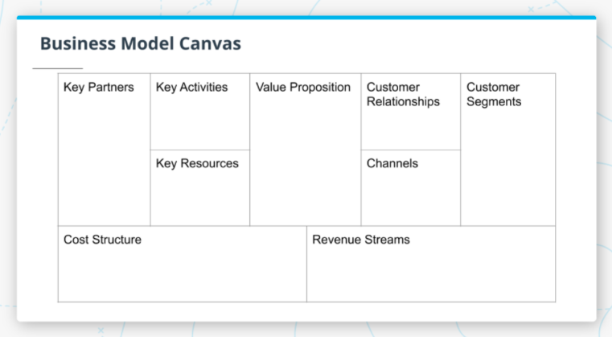
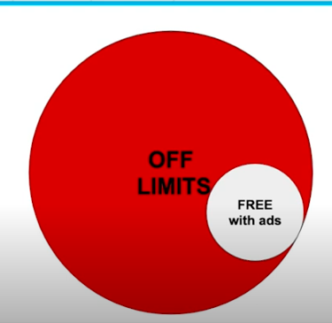
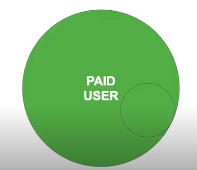
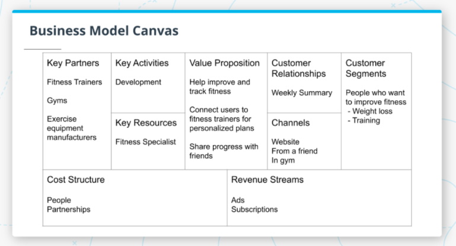
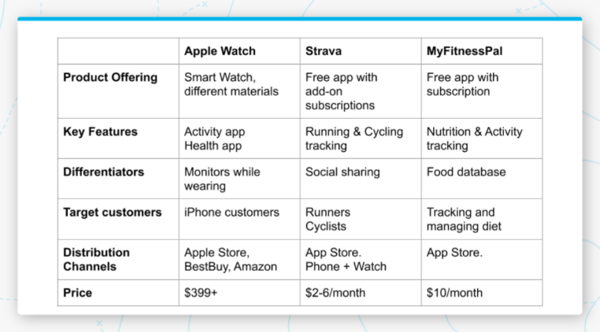

# Table of Contents

a. [Lesson Intro](#Lesson-Intro)   
b. [Vision](#Vision)   
c. [Strategy](#Strategy)   
d. [Business Models](#Business-Models)   
e. [Exercise: Business Model](#Exercise:-Business-Model)   
f. [Solution: Business Model](#Solution:-Business-Model)   
g. [Competitive Analysis](#Competitive-Analysis)   
h. [Exercise: Competitive Analysis](#Exercise:-Competitive-Analysis)   
i. [Solution: Competitive Analysis](#Solution:-Competitive-Analysis)   
j. [MVP](#MVP)   
k. [KPIs](#KPIs)   
l. [Exercise: KPIs](#Exercise:-KPIs)   
m. [Solution: KPIs](#Solution:-KPIs)   
n. [Lesson Recap](#Lesson-Recap)

 
 

# Lesson Intro

Watch [the lesson intro](https://youtu.be/C7M0U0gOHpI).

In this lesson, we’ll cover the following topics:

- Vision
- Strategy
- Business Models
- Competitive Analysis
- MVP
- KPIs

 

Learning objectives:

- Define and craft compelling Vision
- Identify strategic areas to invest in
- Build a Business Model Canvas
- Conduct a Competitive Analysis
- Understand the importance of defining MVP
- Define KPIs

 

Glossary

| Term | Meaning | Definition |
| ---- | ------- | ---------- |
| MVP | Minimum Viable Product | An early version of your product with minimal features that you can take to market in order to get feedback |
| KPI | Key Performance Indicator | KPIs can be used to measure the success of the products |
| Revenue Stream | - | A source of revenue for a company, mostly commonly transaction based or recurring events |
| Subscription | - | A type of revenue model that generates recurring revenue. Users pay a fee on an ongoing basis in exchange for access to your product |
| Licensing | - | A revenue model that generates transaction based revenue. Users purchase a one time license to use your software on an ongoing basis |
| Pay Per Use | - | A revenue model that generates transaction based revenue. Users pay a fee every time they use your product |
| Freemium | - | A revenue model that gives a small part of your product away at no cost to users with the ultimate goal of converting users to paid users in order to gain access to the full product |
| CPC | Cost Per Click | The cost to the advertiser every time a potential customer clicks on their ad.|
| CPM | Cost per 1000 Impressions | The money an advertiser invests for one thousand ad views |
| CTR | Click Through Rate | The percentage of people visiting a web page who access a hypertext link to a particular advertisement |

 
 

# Vision

Watch [Vision](https://youtu.be/OsMptnZZr4M).

What is Vision?

Vision describes...

- what your product looks like in its final state
- the essence of your product
- what your product does and why it matters to users

It should be able to be summarized in a sentence or two. For example, Googe Wifi's vision was to create "a wireless access point that people love."

 

Vision is more than just a sentence. It needs to tell a compelling story about:

- What you’re building
- Who it’s for
- Why it matters

Leverage the research and insights you've already gathered to do this. It needs to stay high level. 

Vision is incredibly important because will impact every single aspect of your product so it is important to be thoughtful when you are crafting your vision. It also gets the team excited and motivated about building the product, and serves as a "north star" for guiding the team and decision making.

Everything you do should trickle down from your vision, including strategy and features. Because it impacts everything you do, it's important to be thoughtful when crafting the vision.

 
 

### Creating Vision

Watch [Creating Vision](https://youtu.be/c1GMrMcKIzc).

You’ll want to make sure that your vision is all of the following:

- `Inspiring:` to get the team excited about the product. Focus on the problem you want to solve and why it matters. How will your product change their life?

> "If you are working on something exciting that you really care about, you don't have to be pushed. The vision pulls you." - Steve Jobs

 

- `Ambitious:` think big. It should be broad, open-ended and challenge the team to think about the problem in different ways. This means it isn't too detailed. 

Ambition gives you leeway to change, adapt and pivot the product as you learn new information, while still working towards an overarching goal.

 

- `Easy to explain:` people should "get it" and understand it when they hear it. A short, concise sentence or two should cover it. The details matter - but belong elsewhere.

 

- `Something the team believes in:` the team has to believe in the vision you're creating by involving them early on. Asking team members to participate in early research and talking with customers can help build belief. You can go through a vision exercise together to co-create the vision too.

 

- `Something you evolve over time:` it's really hard to get things exactly right the first time. It's more imporant to take new information into account and evolve or pivot into a new direction.

 

- `Something you share out frequently:` everyone on the team needs to always be on the same page. They'll use this vision to setup and inform decision making. Tailoring the way you present it to different groups is also important, based on the things they care about the most.

 

Vision serves as a north star to guide the team and decision making as your product is being developed. It explains what you’re building, who it’s for, and why it matters. Vision also gets the team excited and motivated about building the product.

 
 

### Further Readings

[Product Vision](https://www.productplan.com/glossary/product-vision/)

[4 Experts Reveal How to Create a Strong Product Vision](https://blog.hubspot.com/service/product-vision)

 
 

# Strategy

Watch [What is Strategy?](https://youtu.be/VquT7fG7668).

Strategy is how you get to your vision. It's all about how you are going to realize your vision and takes the following things into account:

- `User needs:` Who is your target user? What are their needs that could be solved by this product?

- `Key Features:` What are the key primary features that will solve the user's need? Will these features result in people using the product? Will these features convince people to buy the product?

- `Competitors & Differentiation:` How does your product compare to others in the market? What areas do you want to differentiate in?

- `Business Goals:` What are the business goals of the company and product? It can go beyond revenue. What KPIs can you use to measure these goals?

- `Trends:` How is the market changing? How are user behaviors and needs changing?

 
 

Watch [Creating Strategy](https://youtu.be/oYskzTOgjCc).

When you create strategy, you want to make sure that it’s:

- `A balance between features, user and market needs, and business goals.` Some features you _could_ build won't meet user or business needs; and some might be too expensive to build.
 
- `Creating building blocks for how to get to your vision.` How can you break your strategy out into 3-5 smaller components to realize your vision? These are things your product needs to get absolutely right.

- `High level, but with a little more detail.` Start filling in things with more detail than your vision contained...but the full details will be in the PRDs.

- `Goal oriented, and preferably measurable.` Goals make things actionable because you know what to do. When you can measure your progress towards meeting them, it's even better.

 
 

### Further Readings

[What is Good Product Strategy?](https://medium.com/@melissaperri/what-is-good-product-strategy-8d5587cb7429)

[Product Development Strategy Defined](https://www.thisisproductmanagement.com/blog/product-strategy/)

 
 

# Business Models

Watch [What is a Business Model?](https://youtu.be/UAA5F9oaIkM).

In order to build a viable product, you need to have a business model. 

A business model describes how a business creates, delivers, and captures value. 

This can be represented with a Business Model Canvas - a tool that maps out a business model, created by [Alex Osterwalder](http://alexosterwalder.com).

You can create a business model canvas, which captures a number of different components that will: 

- impact your ability to create and bring a product to market, including...
- things you need to build the product and their associated costs
- the value prop for your product
- getting your product to your customers
- the associated revenue streams

 

 

Looking at the above example Business Model Canvas, we can see on the left are the things that need to happen to build the product and their associated costs.

In the middle is the value proposition that tells what the product is and why people would want it.

On the right is customers (who they are, how you interact with them, how you get the product to them) and revenue streams that customers will generate.

 
 

### The Business Model Canvas

Watch [Business Model Canvas Walkthrough](https://youtu.be/9_yLq1vgWxs).

Let's walk through a Business Model Canvas in more detail and relate it to the video software company Zoom.

The business model canvas includes the following components:

- `Key Partners:` help build or deliver the product to users. These could be resellers or other partners like integrators or payment processors.

    Zoom is mostly software based, but they do work with partners to outfit conference rooms with cameras, TVs and tablets. They also work with system integrators to integrate their technology into existing spaces. They work with payment processors to collect money from their customers. 

 

- `Key Activities:` what you need to do to build and deliver the product, like technical development and setting up sales and support teams.

    Zoom has two main key activities: developing their technology and sales & support.

 

- `Key Resources:` things that you need to deliver value to the user - this could be people, intellectual property, financial backing.

    Zoom relies on data centers to deliver streaming video to participants and a good compression algorithm to deliver high quality video while reducing the bandwidth required.

 

- `Cost Structure:` cost of building the product, that could include fixed costs (like developer salaries) and variable costs that increase as the product grows (like data center capacity). It's important to think through which activites and resources are the most expensive.

    Zoom's two largest costs are people and data centers.

 

- `Value prop:` why would someone want your product?

    Zoom's value prop is that they've built a video conferencing product that works very well. Their product works across devices (phones, laptops, on TVs) and it can scale, by supporting over 1,000 participants in a call.

 

- `Customer Relationships:` how you build relationships with your customer, including through interactions with the product. Sometimes this means building relationships with both the person using the product _and_ the person purchasing the product, because they may be different people in enterprise products.

    At the end of every Zoom call, they ask the user to rate the call. This allows the team to get insights on how the product is performing from the customer's perspective. It reassures the customer that if you had a poor experience, someone will look at that data to improve the product in the future.

    Zoom also has to think about how to build a relationship with the decision maker who purchased the product, like the IT department.

 

- `Channel:` how you get the product to customers. It's important to think about which channels work best and are the most cost effective.

    Zoom has three main channels: their website, where customers can purchase the product directly; referrals, where existing customers invite non-customers to join them in a Zoom meeting; and resellers, who sell the product on their behalf.

 

- `Customer Segments:` understanding the different types of customers. Identifying who they are and which ones are most important.

    Zoom's main customers are distributed teams who need to collaborate and communicate. This is broad and can be further segmented like: enterprise, education, healthcare, government, etc.

 

- `Revenue Streams:` how you get money from customers. What are customers willing to pay for? How much? How do they pay?

    Zoom's main revenue stream is through tiered subscriptions, where more expensive subscriptions offer more features and functionality.

 

The business model canvas is a powerful tool to understand all the components that go into creating a product, understanding its value, and how to get it to your customers.

There are also a variety of different revenue models that you can consider when creating a product. It’s important to understand how users perceive the value of your product and how they interact with your product when creating your revenue model.

 
 

### Practice: The Business Model Canvas

1. Describe Netflix’s Value Prop.

Solution response.

Netflix offers low-cost entertainment with high-quality, low-bandwidth video streaming. It supports multiple user profiles for families. Their slogan is "Watch anywhere, cancel anytime." Their value includes things like stream content anywhere, no ads, and the ability to watch content offline.

 

2. How would you fill in this chart for Netflix's different business model components? (I.e. cost structure, key partners, key activities, and key resources)

| Item | Component |
| ---- | --------- |
| ISPs (Internet Service Provider) | ? |
| Content Creation | ? |
| Licensing Agreements | ? |
| Recommendation Algorithm | ? |
| Software Development | ? |
| Movie Studios | ? |
| Payroll | ? |
| Content Procurement | ? |

 

Solution response.

| Item | Component |
| ---- | --------- |
| ISPs (Internet Service Provider) | Key Partners |
| Content Creation | Cost Structure |
| Licensing Agreements | Key Resources |
| Recommendation Algorithm | Key Resources |
| Software Development | Key Activities |
| Movie Studios | Key Partners |
| Payroll | Cost Structure |
| Content Procurement | Key Activities |

 

3. How would you fill in this chart for more of Netflix's business model components? (I.e. Channels, customer relationships, customer segment and revenue stream)

| Item | Component |
| ---- | --------- |
| Rating System | ? |
| App Store | ? |
| Adults | ? |
| Subscriptions | ? |
| Children | ? |
| Teenagers | ? |
| Built-in TV App | ? |

 

Solution response.

| Item | Component |
| ---- | --------- |
| Rating System | Customer Relationships |
| App Store | Channels |
| Adults | Customer Segment |
| Subscriptions | Revenue Stream |
| Children | Customer Segment |
| Teenagers | Customer Segment |
| Built-in TV App | Channels |

 
 

### Revenue Models

Watch [Revenue Models](https://youtu.be/JjwngEs0JlI).

There’s lots of different revenue models, but some of the most common are:

- `Ads:` Advertisers pay money to show relevant ads to your users.

    Ad based revenue is generated by showing ads in your product(s). These are most effective when you can target the users in meaningful ways. The more effective the targeting is, the better this model will work, because the advertisers will pay on a CPC or CPM basis (cost per click or cost per 1000 impressions). CPC is more common in search products, CPM is more common outside of search.

    Revenue comes from ads being clicked - the more users you have using the product, the more clicks and revenue you'll generate. CTR (click through rate) is an important metric for measuring this.

    Some products supported by ads are Google Search, Facebook, Amazon search listings, and Spotify Free.

 

- `Purchase / Licensing:` Users pay a one-time fee to use the software/product or Companies pay for permission to use/manufacture the product.

    Revenue is based on the total units sold. Companies with a purchase/licensing revenue stream are Microsoft Office and dobe Creative Suite -- although both are moving towards subscriptions.

 

- `Pay per use:` Users pay each time they use the product or service.

    The revenue is generated based on usage. Companies with this model are Uber, DoorDash and Fandango.

 

- `Subscription:` Users pay on a continuous basis for access to the product, usually monthly.

    Revenue comes from paying subscribers. The recurring revenue steams means that as long as you maintain your subscribers, your revenue will come in on a regular, predictable basis.

    Companies that rely on a subscription model are Netflix, Spotify Premium, Microsoft Office 365, and Zoom.

 

- `Freemium:` The product offers a limited number of features for free, with no cost to the user.

    Generally there are limitations or restrictions to the free users which users can remove if they pay for a higher tier that offers more features. 

    This is an easy way to try the product and have the product sell itself.

    Some products with a Freemium model are Spotify, Zoom, LinkedIn, and Dropbox.

 

These are only a few types of revenue models. There are many others that exist. Some of these can overlap, like a freemium model that is supported by ads, with a goal of users converting to a subscription.

You can think of it looking like this at first:

With the ultimate goal of a user converting to this:

 
 

### Further Readings

[Business Model Canvas Examples](https://corporatefinanceinstitute.com/resources/knowledge/strategy/business-model-canvas-examples/)

[10 Most Popular Startup Revenue Models](https://fi.co/insight/the-10-most-popular-startup-revenue-models)

 
 

# Exercise: Business Model

Watch [Business Model Canvas Exercise](https://youtu.be/jjJj8ZTZzDE).

Create a business model canvas for fitness tracker.

You can use the [template here](./Business_Model_Canvas_Template.pdf) or use [Canvanizer](https://canvanizer.com/new/business-model-canvas), a digital canvas creation tool.

 

Try asking yourself...

### Key Partners
Who are your key partners?
Who are your key suppliers?
Which key resources are you acquiring from partners?
Which key activities do partners perform?

### Key Activities
What key activities do our value propositions require?
Our distribution channels?
Customer relationships?
Revenue streams?

### Key Resources
What Key Resources do our value propositions require?
Our distribution channels?
Customer relationships?
Revenue streams?

### Value Propositions
What value do we deliver to our customers?
Which one of our customer's problems are we helping to solve?
What bundles of products and services are we offering to each Customer Segment?
Which customer needs are we satisfying?

### Customer Relationships
What type of relationship does each of our Customer Segments expect us to establish and maintain with them?
Which ones have we established?
How are they integrated with the rest of our business model?
How costly are they?

### Customer Segments
For whom are we creating value?
Who are our most important customers?

### Channels
Through which Channels do our Customer Segments want to be reached?
How are we reaching them now?
How are our Channels integrated?
Which ones work best?
Which ones are most cost-efficient?
How are we integrating them with customer routines?

### Cost Structure
What are the most important costs inherent to our business model?
Which Key Resources are most expensive?
Which Key Activities are most expensive?
What are our fixed costs?
What are our variable costs as we scale?

### Revenue Streams
For what value are our customers most willing to pay?
For what do they currently pay?
How are they currently paying?
How would they prefer to pay?
How much does each Revenue Stream contribute to overall revenue?

 
 

# Solution: Business Model

Watch [the solution walkthrough](https://youtu.be/nbBz2LRw_cU).

 
 

# Competitive Analysis

Watch [What is Competitive Analysis?](https://youtu.be/IdCb8VFhM7Q).

Competitive analysis in its simplest form is identifying other similar products in the market, including the users each product is targeting.

Once you've identified all the competing products, you'll want to understand the strategy behind each one. 

You can get a glimpse of this by using the product and looking at marketing materials. This allows you to identify the strengths and weaknesses of each product. Then you can better predict shifts in the market and trends.

 

As part of competitive analysis, you’ll want to understand:

- Product offering and key features
- Differentiators: how is it different from other competitors?
- Target customers: who is that product intended for?
- Distribution channels: how does that product get to the customer?
- Price points: how does their pricing strategy compare to others?
- Funding

 

So how do you build a competitive analysis?

- `Google:` get a better understanding of what products exist out there
- `Review their websites & marketing material:` to gauge if this product is truly a competitor
- `Use the product:` if it is a competing product, using it helps to understand what it is and how it works, as well as identify user issues
- `Read reviews:` you can also sense how well it's doing by checking user and professional reviews
- `Check social media presence:` check Twitter, Yelp, Reddit, etc. You can learn about the product approach and strengths/weaknesses from these platforms

A good competitive analysis could include key features, differentiators, product screenshots, pricing, target customers, reviews and quotes from customers.

 

### Types of Competitors 

There are three different types of competitors:

- `Primary:` or direct competitors are doing the same thing, mostly the same way, for the same set of users. Android and iOS, Netflix and Disney+, or Uber and Lyft are direct competitors.

- `Secondary:` or indirect competitors are producing a similar product, but in a different way and generally for a different end user. For example, Facebook Messenger and Slack. One is designed for personal use while the other is meant for work environmnet collaboration. Coffee and tea are indirect caffeine competitors.

- `Tertiary:` or replacement competitor where the product does a different job, but competes for the same users. It has the potential for consumers to replace one product with another. For example, a DSLR camera and an iPhone. The DSLR was designed to take high-quality photos, whereas the iPhone has a lot of primary purposes, but also includes a camera. It has begun to replace digital cameras. 

 

Think about Snapchat and identify a few competitors.

Snapchat's direct competitors are Instagram and TikTok, as a media driven social community. Initial selling points focused on privacy and single-view messaging, similar to encrypted messaging platforms like Telegram or Signal. 

A secondary competitor is Youtube - while they do similar functions, Youtube is more long-form and aimed at a public, not 1:1 or network-based, demographic. 

A tertiary competitor is Facebook - it's main use was not to compete with Snapchat, but its growing Stories feature could replace Snapchat. 

 
 

# Exercise: Competitive Analysis

Watch [the competitive analysis exercise prompt](https://youtu.be/GfHr8ud5ua8).

Identify 3-5 competing fitness tracking product, and look into:

- Product offering and key features
- Differentiators
- Target customers
- Distribution channels
- Price points

You can use [this spreadsheet](https://docs.google.com/spreadsheets/d/1T1dmN6CMGux3yh90XgUylJs-XH-vYRWwr-UfHEysoFY/copy) as a template, if it’s helpful.

| Competitor | Product Offering | Key Features | Differentiators | Target Customers | Distribution Channels | Price Points |
| ---------- | ---------------- | ------------ | --------------- | ---------------- | --------------------- | ------------ |
| 1 | ? | ? | ? | ? | ? | ? |
| 2 | ? | ? | ? | ? | ? | ? |
| 3 | ? | ? | ? | ? | ? | ? |
| 4 | ? | ? | ? | ? | ? | ? |
| 5 | ? | ? | ? | ? | ? | ? |

 
 

# Solution: Competitive Analysis

Watch [the competitive analysis solution walkthrough](https://youtu.be/0fifFaSoSqM).

 

 
 

# MVP

Watch [What is MVP?](https://youtu.be/tez-pUdN86Q)

An MVP, or `minimum viable product`, has just enough features to get early adopters excited. 

After launching an MVP, you’ll get a lot of feedback that will help you understand if you have product market fit and what areas you should invest in next.

MVP doesn't mean _broken_, incomplete or un-polished. It should still be a product users are willing to pay for. 

It's still important to invest in good design, reliability and quality experience. It's a starting point for your product to grow into something more -- but if you don't start on good footing, users will abandon it before you have a chance to add more functionality.

 

What are the benefits of an MVP?

- Get product to market fast, or faster than if you built the entire feature set
- Get feedback from real users via an early launch to determine product market fit
- Allows you to fail fast and learn, to iteratively improve or quickly abandon a bad idea

 

How do you create an MVP?

- Start with the business model canvas
- Weigh against competing solutions
- Make sure it’s aligned with business objectives: do you have revenue targets? A necessary launch date? Specific users to attract?
- Translate to requirements, so it's actionable for the team (usually in a PRD)
- Identify KPIs

By definition, an MVP is only _must have_ features.

MVPs allow you to get product to market fast, get feedback from real users, and learn/fail fast.

 

### Further Reading

[What is an MVP?](https://blog.leanstack.com/minimum-viable-product-mvp-7e280b0b9418)

[Types of MVPs and Examples](https://mlsdev.com/blog/minimum-viable-product-examples)

[15+ Example MVPs](https://softwarebrothers.co/blog/15-examples-of-successful-mvps/)

 
 

# KPIs

Watch [What are KPIs?](https://youtu.be/hSwXnrDFtAU)

KPIs, or `Key Performance Indicators`, are a type of metric that measure the performance of your product against your strategy. 

They capture the big picture and help you to understand how well your product is working (or isn’t working) and are aligned with business objectives. 

Additionally, they help to measure how changes you make to your product move the needle (or don’t)

 

There are different types of KPIs:

- `Business:` these measure how you're doing against business goals
- `Product:` these measure how the product is being used and helping users meet their goals
- `Quality:` these measure how often users encounter issues or problems with the product
- `Development:` these measure how well the team is executing when it comes to building and delivering the product

 

Tips for picking KPIs:

- `Don’t measure everything:` it's tempting to do this with all of your data, but you want to be selective when choosing KPIs so they're actionable and easy to understand. If you have too many, you'll waste time tracking their impact and change over time.

- `Align user, product, and business goals:` the best KPIs will hit all three goals at once, but some will focus solely on one of those areas.

- `Make sure KPIs are measurable:` the team should agree on how these KPIs will be measured. When you dig into the data, there can be more complexity than originally considered.

- `Use percentages and time periods when setting goals:` this makes acheiving goals clearer and easier to track

 

Let's go back to examining Zoom and imagine that we're defining their KPIs.

 

| Type of KPI | KPI |
| ----------- | --- |
| Business | ARPU (Average Revenue Per User) |
| Business | Conversion rate from free to subscription |
| Business | Churn (how often users stop using the product) |
| Product | Weekly Active Users |
| Product | Average number of calls per user per week |
| Product | Average time for user to setup their first call |
| Quality |  Percentage of calls delivered in HD to ensure a key value prop is being met |
| Quality |  Average user rating per call |
| Quality |  Support contact rate (instance per 100 users) |
| Development | Percentage of features delivered on time |
| Development | Average deviation from original estimated delivery date |
| Development | Outages per month and for how long |

 

Fill in this chart with the following: `Uptime`, `Feature Usage`, `Team Velocity` and `Revenue` 

| Type of KPI | KPI |
| ----------- | --- |
| Business | ? |
| Product | ? |
| Quality | ? |
| Development | ? |

 

 See the solution 

| Type of KPI | KPI |
| ----------- | --- |
| Business | Revenue |
| Product | Feature Usage |
| Quality | Uptime |
| Development | Team Velocity |

 

 True or false: You want to have as many KPIs as possible 

False - you want to have a small, focused set of KPIs. This will allow the team to focus on moving those specific KPIs.

 

 
True or false: A metric is always a KPI 

False - while every KPI is a metric, not every metric will be a KPI. KPIs are metrics that capture the performance of your product against your strategy.

 

### Further Reading

[4 Things to Remember When Defining KPIs](https://blogs.oracle.com/datascience/4-things-to-remember-when-defining-kpis)

[18 KPI Examples Explained](https://www.clearpointstrategy.com/18-key-performance-indicators/)

 
 

# Exercise: KPIs

Watch .

 
 

# Solution: KPIs

Watch .

 
 

# Lesson Recap

Watch .

 
 