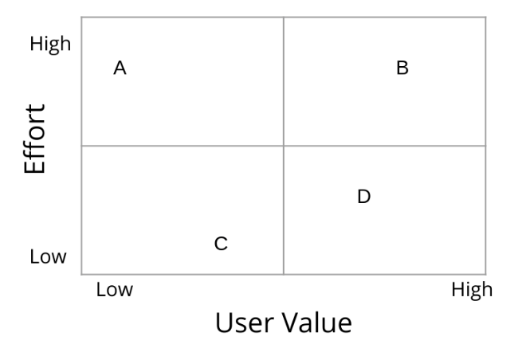
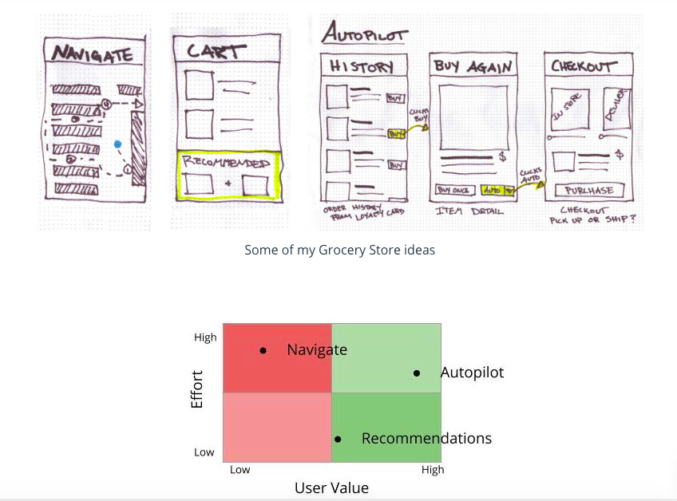

# Table of Contents

a. [DECIDE](#DECIDE)  
b. [Assumptions & Questions](#Assumptions-&-Questions)  
c. [Exercise: Assumptions & Questions](#Exercise:-Assumptions-&-Questions)  
d. [Solution: Assumptions & Questions](#Solution:-Assumptions-&-Questions)  
e. [Decision Matrix](#Decision-Matrix)  
f. [Exercise: Decision Matrix](#Exercise:-Decision-Matrix)  
g. [Solution: Decision Matrix](#Solution:-Decision-Matrix)  
h. [Thinking Hats](#Thinking-Hats)  
i. [Exercise: Thinking Hats](#Exercise:-Thinking-Hats)  
j. [Solution: Thinking Hats](#Solution:-Thinking-Hats)  
k. [Lesson Recap](#Lesson-Recap)  

 

# DECIDE

Watch [phase 4: Decide.](https://youtu.be/PVPQj9w5oAg)

Lots of ideas! And it’s now time to pick the best one. We’ll cover a couple different ways that you can start to converge on a single idea to prototype and test.

In this lesson, we’ll cover the following topics:

- The Decide phase of the Design Sprint
- Assumptions & Questions
- Decision Matrix
- Thinking Hats

At the end of this lesson, you’ll be able to:

- Describe the Decide phase of the Design Sprint
- Articulate assumptions behind ideas and question them
- Create a Decision Matrix
- Represent perspectives from a wider audience

 

### Glossary

| Term | Definition |
| ---- | ---------- |
| Decision Matrix | A method to visualize the trade offs between different ideas |
| Thinking Hats | A method to ensure that different perspectives are being discussed |

 
 

# Assumptions & Questions

Watch [Assumptions & Questions.](https://youtu.be/RQ5wba2E2IY)

Questioning assumptions is a good way to make sure that you don’t get stuck in a specific way of thinking

It’s easiest to start by identifying assumptions, and then drilling down and asking questions to see if those assumptions still stand

 

True or False: Questioning assumptions will always lead to alternative, innovative ideas.

False - Not always. Often times you will find false assumptions, it’s not always guaranteed to happen.

 

Think about [Spectacles by Snapchat](https://www.spectacles.com/) (sunglasses with a camera and Snapchat integration). Write an assumption that the product made

Good examples could include assumptions related to privacy, for example, “People don’t mind being recorded”

 

Now turn that assumption into a question

A good question should challenge the assumption from the previous quiz, for example “Are bystanders comfortable with their image being captured without their knowledge” or “Will people interact or feel different when talking to someone who is wearing a camera on their face?”

 
 

# Exercise: Assumptions & Questions

Exercise: Grocery Store Chain App Assumptions and Questions
Let's take a closer look at your Grocery Store Chain product Solution Sketch -- or you can look at my Autopilot Solution Sketch below.

What assumptions did you make? How can you turn those assumptions into questions?

Look carefully at the Autopilot Sketch. What assumptions does it make?

Re-write the assumptions you identified above as questions

 
 

# Solution: Assumptions & Questions

Watch [the solution video.](https://youtu.be/VzDJD_BeKsU)

Questioning assumptions is a good way to make sure that you are exploring all angles of a solution.

A sample response might look like...

 

| Assumptions | Questions |
| ----------- | --------- |
| Consumers buy the same items | Do consumers buy the same items? Are there factors that affect item choice (ie: will some people just buy what’s cheapest) |
| Consumers buy some items on a regular cadence | What factors affect how often consumers purchase an item? |
| Consumers are comfortable with a set it and forget it type of subscription for some types of goods | Are consumers comfortable with a subscription? What types of goods would consumers be comfortable subscribing to? |

 

### Further Reading

[Don't Make Me Think - Key Learning Points for UX Design for the Web](https://www.interaction-design.org/literature/article/don-t-make-me-think-key-learning-points-for-ux-design-for-the-web)

[Asumption Busting](http://creatingminds.org/tools/assumption_busting.htm)

 
 

# Decision Matrix

Watch [Decision Matrix.](https://youtu.be/feTebgZqKA0)

A decision matrix allows you to visualize the trade offs between different ideas when comparing across two criteria.

Ideas generally worth pursuing will be high value & low effort or high value & high effort

Ideas that are low value & high effort are generally not worth pursuing unless value increases or effort decreases in the future

Ideas that may not make sense to pursue now, may be worth pursuing later if the value of the idea increase or the effort to pursue the idea decreases

 

Which ideas are worth pursuing?

High value/high effort and high value/low effort ideas are the best ideas to pursue

 

 

Which of the ideas in the above matrix is the best one to move forward with in the Design Sprint?

B! B provides a lot of user value, as well as a decent amount of effort (which means it will be harder for others to duplicate)

 

D might sometimes be correct if resources are tight because D provides high user value and not much effort. The downside is that low effort ideas can also be duplicated by others quickly.

 

Even though C doesn’t require much effort, it does not provide much user value. And A doesn't provide much value _and_ is a lot of effort.

 

Decision Matrix Practice

In the next two quizzes we will consider four different product ideas.

- A feature that screens calls from suspected scammers
- An app that alerts you when your shoelaces are untied
- A feature that allows you to unsend an email up to one minute after you sent it.
- An app that lets you play 10 different animal sounds

 

How would you categorize the four product ideas?

| Idea | Value & Effort |
| ---- | -------------- |
| A feature that screens calls from suspected scammers | High value, High effort |
| An app that alerts you when your shoelaces are untied | Low value, High effort |
| A feature that allows you to unsend an email up to one minute after you sent it. | High value, Low effort |
| An app that lets you play 10 different animal sounds | Low value, Low effort |

 

Which of these four ideas should the team pursue? Why?

There are two ideas that I’d recommend the team look into...

The first is the unsend idea. Have you ever wanted to unsend an email right you sent it because you noticed a typo or remembered something else you wanted to include? I know I have… There’s a lot of value in this feature and likely you could use a simple timer to delay sending so that users have a chance to “unsend”. 

The second is the call screening idea. Spam calls are a huge annoyance! Screening spam calls is a hard problem to solve but there’s a ton of user value if it can figure out how to do it right.

 
 

# Exercise: Decision Matrix

Exercise: Grocery Store Decision Matrix

Let's apply the Decision Matrix tool to the Grocery Store ideas. You can use your own ideas, use my ideas from the Crazy 8's sketches below, or come up with some completely new ideas.

Create a Decision Matrix to explore ideas for the Grocery Store Chain app

- [ ] Create a 2x2 Decision Matrix table
- [ ] Label the x-axis "User Effort"
- [ ] Label the y-axis "Effort"
- [ ] Pick 3 ideas for the Grocery Store Chain app and write each on a sticky note
- [ ] On each sticky, add a short explanation of the value and an estimate of the effort including rationale 
- [ ] Place each idea in a quadrant
- [ ] Circle the ideas that are worth pursuing

 
 

# Solution: Decision Matrix

Watch [the solution walkthrough.](https://youtu.be/z3BiUc9f_98)

 

 

A decision matrix is a visual tool that allows you to sort and compare things across a set of criteria.

- Draw a matrix on a white board and label your axes
- Write each idea onto a sticky note
- For each idea, have a short discussion on which is the appropriate quadrant
- Then place the sticky note into the appropriate quadrant

### Further Reading

[The Decision Matrix](https://designsprintkit.withgoogle.com/methodology/phase4-decide/decision-matrix)

 
 

# Thinking Hats

Watch 

### Further Reading

 
 

# Exercise: Thinking Hats

Watch 

### Further Reading

 
 

# Solution: Thinking Hats

Watch 

### Further Reading

 
 

# Lesson Recap

Watch 

### Further Reading

 
 
