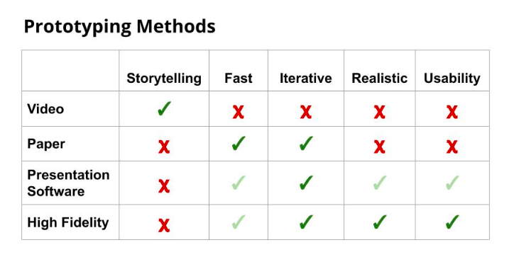

# Table of Contents

a. [Prototype](#Prototype)  
b. [Storyboard](#Storyboard)  
c. [Storyboarding using theplot.io](#Storyboarding-using-theplot.io)  
d. [Exercise: Create a Storyboard](#Exercise:-Create-a-Storyboard)  
e. [Solution: Create a Storyboard](#Solution:-Create-a-Storyboard)  
f. [Design Best Practices](#Design-Best-Practices)  
g. [Prototype](#Prototype)  
h. [Prototyping with Figma](#Prototyping-with-Figma)  
i. [Exercise: Prototype with Figma](#Exercise:-Prototype-with-Figma)  
j. [Solution: Prototype with Figma](#Solution:-Prototype-with-Figma)  
k. [Lesson Recap](#Lesson-Recap)  
 

# Prototype

Watch [Phase 5: Prototype.](https://youtu.be/2q-2cqmqTxQ)

Prototyping is a fast and cheap way to test and validate your idea. Your prototype doesn’t have to capture the full product end to end, but should definitely focus on the core questions about your idea that you need to answer.

In this lesson, we’ll cover the following topics:

- The Prototype phase of the Design sprint
- Storyboards
- Video prototypes
- Paper prototypes
- Presentation software prototype (e.g. Microsoft PowerPoint or Google Slides)
- Interactive prototypes
- Best practices

 

At the end of this lesson, you’ll be able to:

- Describe the Prototype phase of the Design Sprint
- Create a storyboard to map out a plan for your prototype
- Describe the different types of prototyping
- Create a high fidelity, interactive prototype
- Use best practices for creating prototypes

 

### Glossary

| Term | Definition |
| ---- | ---------- |
| Storyboard | A map of a user's experience with a product |
| Prototype | A model of the most critical features of a product |

 
 

# Storyboard

Watch [Storyboarding.](https://youtu.be/_lL_0vdXHKA)

 

 

Storyboard maps out the problem facing your user and the journey they go through with your product to solve it

A storyboard is composed of frames that depict events along the user journey

Each frame should have a caption that explains what is happening and why

The first frame should explain how the user found themselves in this scenario and what is the problem they are trying to solve

The storyboard will become the blueprint for the prototype

 

What should a storyboard have?

Multiple frames that depict the user journey and a caption for each frame.

 

True or false: The first frame of a storyboard should start with an introduction UI for your concept.

False - The first frame should always set the stage and explain the problem the user is facing

 

### Further Reading

[The Role of Storyboarding in UX Design](https://www.smashingmagazine.com/2017/10/storyboarding-ux-design/)

 
 

# Storyboarding using theplot.io

Watch [Storyboarding with theplot.io](https://youtu.be/JidGBIJVIAw)

 

[The Plot.io](https://theplot.io) is an online tool to help storyboard any type of media project.

- Write your script first, and then create images for each frame
- The first frame should articulate the problem
- The last frame should show how your product helped the user solve the problem
- The frames in between the first and last frame should show how the user gets from the problem to the solution

### Further Reading

[The Plot Tutorial](https://theplot.io/#tutorial)

 
 

# Exercise: Create a Storyboard

Exercise: Creating a Storyboard for the Grocery Store Chain App

It's time to make our Grocery Store Chain app idea more real. Let's make a storyboard of the user flow using [thePlot.io](https://theplot.io)

Create a storyboard for your Grocery Store app idea:

- [ ] Go to theplot.io and create a free account
- [ ] Create a New Project with 8 frames
- [ ] Write the script for the first frame to explain the problem that the user is trying to solve
- [ ] Write the script for the last frame to show that the problem was solved
- [ ] Fill in the scripts for rest of the frames to show how the Grocery Store Chain app helps the user solve their problem
- [ ] Revisit the last frame to make sure it connects to the rest of the story
- [ ] Add images for each frame

 
 

# Solution: Create a Storyboard

Watch [the solution walkthrough.](https://youtu.be/VGJ2Jrf_REk)

 

 

Boom! We just made a storyboard

- You created a storyboard using theplot.io
- You started by creating your first frame and describe the problem the user is facing
- Then you created your last frame and described the value of what your product allowed the user to do
- And then you created frames in between to explain how the user got from the problem they were facing to the solution using your product!
- Alternative tools:

Theplot.io is a great tool for building storyboards, but there are lots of other tools out there as well!

- By hand on paper
- [Storyboarder](https://wonderunit.com/storyboarder/)
- [Boords](https://boords.com/)

 
 

# Design Best Practices

Watch [Prototype Best Practices.](https://youtu.be/-8WgZNW31SU)

Watch [a Prototyping Walkthrough.](https://youtu.be/1WFAqhZ7D1w)

 

`Stay focused.` Identify the screens/flows that you need to build in order to test your idea

`Use a template.` Build a base screen that you can duplicate to use as the foundation for additional screen

`Keep it real.` Avoid using placeholder assets and copy. This will change the way that users interact with and provide feedback about your prototype

`Test it.` Click through your prototype once your done to make sure everything is working

It doesn’t have to be perfect, but it does need to feel realistic.

 

True or false: When building a prototype you need to build every screen that would appear in your app

False - You don’t need to build out every screen that you would have in your app.

 

True or false: When building a prototype you should avoid using placeholder copy. 

True. You should not use placeholder copy because you will miss out on valuable feedback about how users are interpreting those words

 

### Further Reading

[10 Mobile App Prototyping Best Practices that Result in a Stellar Finished Product](https://medium.com/@protoio/10-mobile-app-prototyping-best-practices-that-result-in-a-stellar-finished-product-feac3274d2ac)

 
 

# Prototype

Watch [Prototyping.](https://youtu.be/kXUvGPvttE4)

 

| Type | Effort | Pros | Cons |
| ---- | ------ | ---- | ---- |
| Video | high | Very powerful, exciting, shows end to end user journey | Takes a long time to make even short videos, Can get people too excited |
| Paper | low | Fast, cheap, and easy to iterate. Also works great as a team building exercise since everyone can be involved | Won’t resemble a digital product, can sometimes be difficult for participants to imagine it as if it were a digital software experience |

 
 

Watch [Presentation Software and Hi Fidelity Prototypes](https://youtu.be/dxDB-0h7TxA)

 

| Type | Effort | Pros | Cons |
| ---- | ------ | ---- | ---- |
| Presentation Software | med | Relatively easy to build and gets pretty close to mimicking what the real experience could feel like | Need to pay lots of attention around alignment, lots of importing mocks and checking alignment |
| High fidelity | med | Super realistic, can quickly be updated, can be used as a spec that engineers build off of | Sometimes the prototype is too good… And doesn’t reflect what will actually be built (ie: latency) |

 
 

Watch [Which Prototyping Method to Use?](https://youtu.be/jHYOBudFsXU)

 

 

Prototyping is a cheap way to get feedback on an idea without having to build out the whole idea. There are a number of different types of prototypes that you can build depending on the specifics of the problem you are tackling and the timelline involved.

After you run your prototype through user testing, you’ll get helpful feedback to let you know that you are on the right track or that you need to course correct.

 

What are some of the advantages of paper prototyping?

Paper prototyping is both fast and cheap. Paper prototyping is tactile, but that’s not really a pro in this case since you likely aren’t being a paper product. Paper prototyping does not result in a realistic experience for users to walk through.

 

True or false: A video prototype is effective at getting feedback on specific flows

False. Generally a video prototype is more focused on validating the concept rather than a specific flow

 

Which would be the most effective prototyping method for a new futuristic concept that is likely 3+ years out?

A video would be the best medium to capture and express the intent behind a futuristic idea

It will be difficult to communicate a futuristic idea through a paper prototype.

High fidelity and Presentation Software prototypes are better at getting feedback around the actual interaction and flow. Since this idea is more futuristic, the exact flow is not as important as the idea itself.

 

Which type(s) of prototyping are best suited to get usablity feedback?

Both presentation software and high fidelity prototypes can be used to get usability feedback because they are interactive and resemble the final product.

 

Imagine that you are building a prototype of a mobile app for a new feature that the team is planning to launch in the next 6 months. What woud be the best way to test it?

Running the prototype on a mobile phone is the best way to test features that will launch soon since it communicates both the concept and allows you to get usability feedback. It’s great to also run the prototype on the same type of device that the product is designed for because it makes the experience more realistic.

 

### Further Reading

[The Magic of Paper Prototyping](https://uxplanet.org/the-magic-of-paper-prototyping-51693eac6bc3)

[How to Prototype an App with PowerPoint](https://keynotopia.com/guides-ppt/)

Other tools for high fidelity prototypes: [Flinto](https://www.flinto.com/) , [Proto.io](https://proto.io/)

 
 

# Prototyping with Figma

Watch [Prototyping with Figma.](https://youtu.be/Lhs5mjjr8YM)

Watch [Running Your Figma Prototype](https://youtu.be/OBOTv6GCm1M)

Start by creating a base template

Once your template is complete, you can copy that frame to use as a starting point for your other screens

When your mocks are done, go into prototyping mode and create connections between your frames

Test your prototype to make sure everything is working correctly

 

### Further Reading

[Figma: Getting Started with Prototyping](https://help.figma.com/article/199-getting-started-with-prototyping)

[Figma Mirror App for Android](https://play.google.com/store/apps/details?id=com.figma.mirror)

[Figma Mirror App for iOS Devices](https://apps.apple.com/us/app/figma-mirror/id1152747299)

[Figma Mirror for Browsers](https://www.figma.com/mirror)

 
 

# Exercise: Prototype with Figma

Exercise: Create a Prototype of the Grocery Store Chain App with Figma

Our storyboard has given us a good blueprint for our prototype. Now let's build a high fidelity prototype with Figma.

Use Figma to create a high fidelity prototype:

- [ ] Go to Figma.com and create a free Starter account
- [ ] Review the “Figma Basics” and “Prototyping in Figma” videos
- [ ] Create a New File for your project
- [ ] Add at least 5 frames
- [ ] Go into prototype mode and create connections between your frames
- [ ] Run your prototype to confirm that it works

 
 

# Solution: Prototype with Figma

Watch [the solution walkthrough.](https://youtu.be/QVYLo06eL6g)

View the [solution prototype](https://www.figma.com/proto/knZ2OjqnVzpOp6jWeWdPZg/Autopilot?node-id=1%3A4&scaling=scale-down).

Once you’ve created mocks in Figma, you can use the built-in prototype tool to quickly draw out flows. You’ll have a working click through prototype and can easily change it based on feedback by updating mocks.

 
 

# Lesson Recap

Watch [the lesson recap.](https://youtu.be/2zHntt-HC6I)

You’ve reached the end of the Phase 5: Prototype. We covered the following topics:

- The Prototype phase of the Design sprint
- Best practices
- Storyboards
- Storyboarding using theplot.io
- Prototyping
- Video prototypes
- Paper prototypes
- Presentation Software prototypes
- Interactive prototypes
- Prototyping using Figma

 

At this point, you should be able to:

- Describe the Prototype phase of the Sketch Sprint
- Use best practices for creating storyboards and prototypes
- Create a storyboard that describes the user context and journey
- Describe the different types of prototyping and their associated pros and cons
- Create a high fidelity, interactive prototype using Figma

 
 