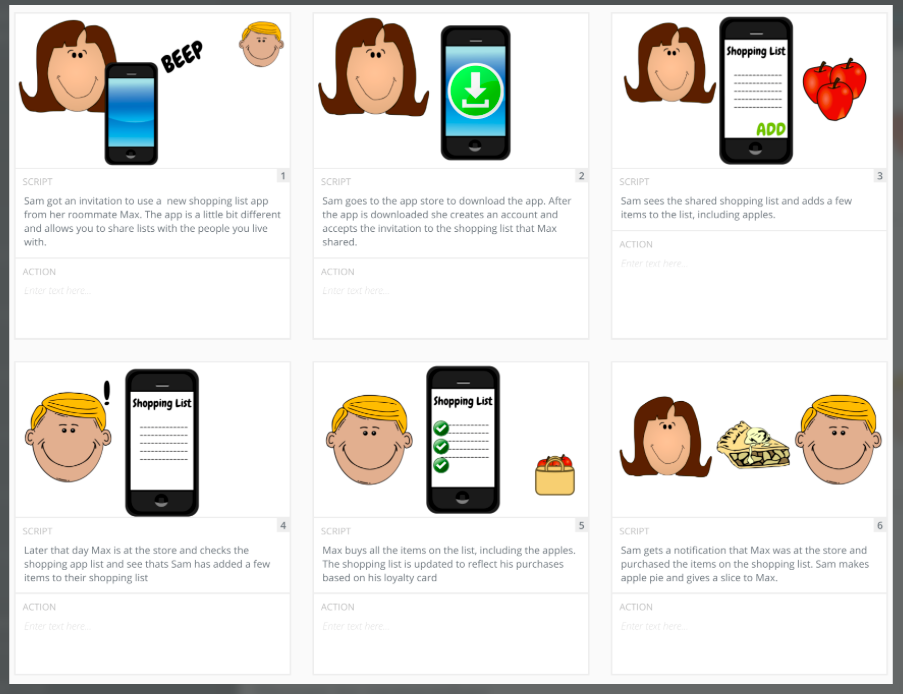
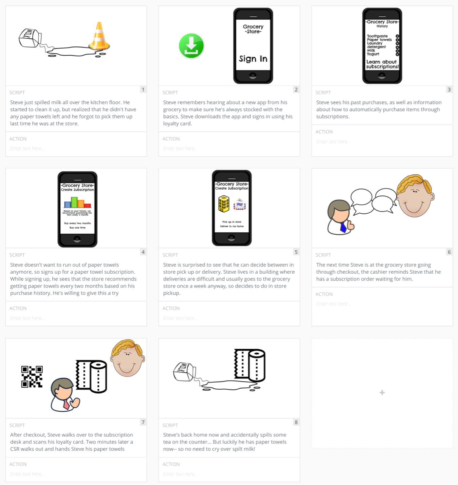

# Table of Contents

a. [Prototype](#Prototype)  
b. [Storyboard](#Storyboard)  
c. [Storyboarding using theplot.io](#Storyboarding-using-theplot.io)  
d. [Exercise: Create a Storyboard](#Exercise:-Create-a-Storyboard)  
e. [Solution: Create a Storyboard](#Solution:-Create-a-Storyboard)  
f. [Design Best Practices](#Design-Best-Practices)  
g. [Prototype](#Prototype)  
h. [Prototyping with Figma](#Prototyping-with-Figma)  
i. [Exercise: Prototype with Figma](#Exercise:-Prototype-with-Figma)  
j. [Solution: Prototype with Figma](#Solution:-Prototype-with-Figma)  
k. [Lesson Recap](#Lesson-Recap)  
 

# Prototype

Watch [Phase 5: Prototype.](https://youtu.be/2q-2cqmqTxQ)

Prototyping is a fast and cheap way to test and validate your idea. Your prototype doesn’t have to capture the full product end to end, but should definitely focus on the core questions about your idea that you need to answer.

In this lesson, we’ll cover the following topics:

- The Prototype phase of the Design sprint
- Storyboards
- Video prototypes
- Paper prototypes
- Presentation software prototype (e.g. Microsoft PowerPoint or Google Slides)
- Interactive prototypes
- Best practices

 

At the end of this lesson, you’ll be able to:

- Describe the Prototype phase of the Design Sprint
- Create a storyboard to map out a plan for your prototype
- Describe the different types of prototyping
- Create a high fidelity, interactive prototype
- Use best practices for creating prototypes

 

### Glossary

| Term | Definition |
| ---- | ---------- |
| Storyboard | A map of a user's experience with a product |
| Prototype | A model of the most critical features of a product |

 
 

# Storyboard

Watch [Storyboarding.](https://youtu.be/_lL_0vdXHKA)

 

 

Storyboard maps out the problem facing your user and the journey they go through with your product to solve it

A storyboard is composed of frames that depict events along the user journey

Each frame should have a caption that explains what is happening and why

The first frame should explain how the user found themselves in this scenario and what is the problem they are trying to solve

The storyboard will become the blueprint for the prototype

 

What should a storyboard have?

Multiple frames that depict the user journey and a caption for each frame.

 

True or false: The first frame of a storyboard should start with an introduction UI for your concept.

False - The first frame should always set the stage and explain the problem the user is facing

 

### Further Reading

[The Role of Storyboarding in UX Design](https://www.smashingmagazine.com/2017/10/storyboarding-ux-design/)

 
 

# Storyboarding using theplot.io

Watch [Storyboarding with theplot.io](https://youtu.be/JidGBIJVIAw)

 

[The Plot.io](https://theplot.io) is an online tool to help storyboard any type of media project.

- Write your script first, and then create images for each frame
- The first frame should articulate the problem
- The last frame should show how your product helped the user solve the problem
- The frames in between the first and last frame should show how the user gets from the problem to the solution

### Further Reading

[The Plot Tutorial](https://theplot.io/#tutorial)

 
 

# Exercise: Create a Storyboard

Exercise: Creating a Storyboard for the Grocery Store Chain App

It's time to make our Grocery Store Chain app idea more real. Let's make a storyboard of the user flow using [thePlot.io](https://theplot.io)

Create a storyboard for your Grocery Store app idea:

- [ ] Go to theplot.io and create a free account
- [ ] Create a New Project with 8 frames
- [ ] Write the script for the first frame to explain the problem that the user is trying to solve
- [ ] Write the script for the last frame to show that the problem was solved
- [ ] Fill in the scripts for rest of the frames to show how the Grocery Store Chain app helps the user solve their problem
- [ ] Revisit the last frame to make sure it connects to the rest of the story
- [ ] Add images for each frame

 
 

# Solution: Create a Storyboard

Watch [the solution walkthrough.](https://youtu.be/VGJ2Jrf_REk)

 

 

Boom! We just made a storyboard

- You created a storyboard using theplot.io
- You started by creating your first frame and describe the problem the user is facing
- Then you created your last frame and described the value of what your product allowed the user to do
- And then you created frames in between to explain how the user got from the problem they were facing to the solution using your product!
- Alternative tools:

Theplot.io is a great tool for building storyboards, but there are lots of other tools out there as well!

- By hand on paper
- [Storyboarder](https://wonderunit.com/storyboarder/)
- [Boords](https://boords.com/)

 
 

# Design Best Practices

Watch 

### Further Reading

 
 

# Prototype

Watch 

### Further Reading

 
 

# Prototyping with Figma

Watch 

### Further Reading

 
 

# Exercise: Prototype with Figma

Watch 

### Further Reading

 
 

# Solution: Prototype with Figma

Watch 

### Further Reading

 
 

# Lesson Recap

Watch 

### Further Reading

 
 