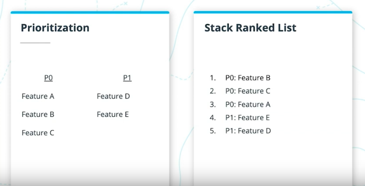

# Table of Contents

a. [Introduction](#Introduction)   
b. [The Role of the PM](#The-Role-of-the-PM)  
c. [What a PM Does](#What-a-PM-Does)   
d. [Who PMs Work With](#Who-PMs-Work-With)   
e. [Exercise: New PM](#Exercise:-New-PM)   
f. [Solution: New PM](#Solution:-New-PM)   
g. [Identifying Requirements](#Identifying-Requirements)   
h. [The Roadmap & PRD](#The-Roadmap-&-PRD)   
i. [Exercise: Write a PRD](#Exercise:-Write-a-PRD)   
j. [Solution: Write a PRD](#Solution:-Write-a-PRD)   
k. [Exercise: Build a Roadmap](#Exercise:-Build-a-Roadmap)   
l. [Solution: Build a Roadmap](#Solution:-Build-a-Roadmap)   
m. [Lesson Recap](#Lesson-Recap)   

 
 

# Introduction

Watch [here](https://youtu.be/yN_AsRhl6D4).

In this lesson, we’ll cover the following topics:

- The Role of a PM
- What a PM Does
- Who PMs work with
- Identifying Requirements
- The Roadmap & PRD

At the end of this lesson, you’ll be able to:

- Understand the purpose of the PM role
- Understand what a PM does during the different stages of the Product Development Cycle
- Identify key cross-functional partners and customize communications based on understanding of their key priorities
- Describe different methods for gathering requirements
- Define the components of a PRD and how to complete each component including documenting requirements

 
 

### Glossary

 

| Term | Meaning | Definition |
| ---- | :-----: | :--------: |
| PRD  | Product Requirements Doc | A document written by a product manager that describes why a product should be built and what the product should do, as well as how to measure success of the product. |
| Roadmap |  | A document that describes when specific products and features will be built. |
| PgM | Program Manager | A person who helps a variety of teams (engineering, design, ops, etc) execute against the product roadmap. A program manager keeps the team productive and on track, as well as flags risks. |
| TPM | Technical Program Manager | A more technical program manager, who works closely with engineering teams to execute against the product roadmap. A TPM is more involved in the technical details of software development. |
| QA | Quality Assurance | A team that creates test plans and tests your product to identify and prevent bugs and issues from entering production and affecting users. |
| PR | Public Relations | A team that helps you tell the story about your product with the public and media. |
| i18n | Internationalization | A team and/or process that helps you bring your product to new markets around the globe. |

 
 

# The Role of the PM

Watch [here](https://youtu.be/jrOLvPwieBE).

At its very core, the role of the PM is to make sure that the team is solving the right problems and successfully building products people want. 

 

PMs are centered in the middle of Design, Business and Technology.

Within Design, PMs focus on:
- the User needs
- the User's motivations
- being the User's advocate

For Business, PMs focus on:
- business goals
- aligning product to meet those goals

On the Technology side, PMs:
- understand how the product is build
- the complexity, risk and tradeoffs

A PM might skew more heavily to one dimension or another, but must combine a background in all three to be successful.

 

Throughout this process, Product Managers will shepherd their product from an idea all the way through launch and partner with a wide variety of cross functional teams to make the product real. 

However, PMs rarely have any direct authority over the teams they work with. They don't manage anyone building the product, so they have to be able to influence without authority. They work with everybody to define what the product will do and why it should be built.

Building strong relationships with team members to influence them to work towards a shared vision is key. Getting to know each team member better helps keep them excited on a shared focus, while hearing their individual concerns.

 

The PM must identify and define problems to ensure it's the right problem to solve at that moment. What is the outcome if the problem is solver? Or not?

Solvings problems can:
- Make the product more appealing to users
- Increase sales
- Reduce user churn
- Keep the company competitive in the market
- Increase team efficiency
- Be required for legal compliance

PMs consider the `impact` of solving the problem with the required `effort` to solve it, to determine the ROI of a potential solution.

 

Prioritization also plays an important role in this process, since no company has unlimited resources-- there will always be tradeoffs that need to be made.

PMs have to tune out some problems (at least until a later date). What should the team be working on _right now_?

 

While there might be many high priority features, stack ranking can help identify exactly which order (and why) the team should tackle them.

This chart comparison shows how changing ranking styles still allows a team to maintain prioritization labels (`P0`, `P1`) but also indicate exactly what order matter most _right now_.

The ranking is determined by data.

 

PMs are the spokesperson for their product. They should be able to answer almost any question about their product _or_ know where to find the answer.

They keep the involved teams aware of current status, bottlenecks and deadlines. They're also responsible for securing buy-in from cross-functional teams and stakeholders. PMs keep the product development coordinated across various teams, on a single deadline.

PMs don't manager engineers and designers directly, so they must influence those technical teams through explicit and persuasive communication. Keeping teams excited about problem solving ensures they coordinate well together.

 

Each day differs and is unpredictable due to unexpected fires or changing specs. 

 
 

### The Differences in Product Management

Watch [The Differences in Product Management](https://youtu.be/XVitJwNZRJA)

The role of a PM can vary a lot based on the company and product. The size of a company has a big impact on the scope of a PMs work. 

At smaller companies it's more likely that PMs will have more end to end responsibility and wear more hats. Their role covers a broader focus with less support in place. 

There tends to be fewer processes defined - which means moving faster, but more chaotically. Creating process and stability for the team will have positive impact.

 

At larger companies oftentimes there will be larger supporting teams, which allow PMs to maintain a narrow focus and go super deep on that specific area.

There are larger supporting teams to help (in research, marketing and finance) so a PM is focused on coordinating across those teams, rather than executing those roles.

With more processes, development can be slower to ensure that no single product negatively effects other products (whether existing or also being developed).

At these companies, collaborating with other PMs is integral to executing well.

 

A company’s philosophy to building products also shapes the role of a PM. 

The most common philosophies are:

`Product Driven` companies focus on solving problems for users. PMs at theses companies will focus on writing requirements to hand-off to engineering, through research and user tests.

It's very customer centric and more likely to be what consumers want, but engineering can feel disconnected from the user and lack empathy for why the product matters. If they don't see the big picture, a PM's laid out requirements might feel arbitrary, so conveying it well matters.

Amazon Prime is an easy, fast and convenient value-add to Amazon's users.

 

`Engineering Driven` organizations focus on  solving technical problems. Engineers build things, then hand them off to Product who will bring it to market.

The PMs role is about how to package the technology. This promotes technical innovation and handles when users don't necessarily know what they want or need. It can solve a deeper root issue.

This increases the prossibility that the product won't resonate with the customer because the idea didn't originate from them. 

Google Glass was an amazing technology - but it didn't solve a problem people really had.

 

`Product + Eng partnership` hybrid led companies. 

In these, PMs write requirements but Engineering is included in identifying those requirements. 

Engineering is included in market and user research, then builds it based on those requirements, with the PM included in the Engineering Design conversations. This allows both parties to consider the trade-offs of each solution.

 
 

### The Types of Users

Watch [The Types of Users](https://youtu.be/KCPI9f5bt-Q)

A PM's role will change depending on the type of user they are designing for.

 

`Consumer Facing Products` are focused on solving user problems and providing value to the user.

The focus is usually on simple, clean UX for easy to use products.

Typically, the user purchases the product. The team will iterate and experiment fairly quickly.

 

`Enterprise Products` focus on solving business problems (like workflows and process improvements).

PMs have to understand both the business' and end users' needs, not just one or the other.

The bulk of the value is to the company that purchases the product though. Ultimately, the company is the paying customer, even if employees are the ones using it. 

The user and customer are not the same.

In a B2B environment, there are many more problems to identify and manage, plus iterations can take longer to execute as businesses are more change averse than consumers.

 
 

### Types of Product

PMs can also specialize in different types of product, such as:

- `Data`: how data can be used to build and power products, potential through Machine Learning.
    PM's get deep on data and numbers, not just to analyze the data but to also understand how the product can be built on top of extensive data. Self-driving cars, Netflix recommendations, etc.

- `Growth`: PMs grow the product through features that drive adoption.
    This can be directly, like a "Refer a Friend" feature, or indirectly, through features that convince the user to buy the product (upgraded plans). They have a deep understanding of the user funnel, optimization, acquisition and onboarding strategies.

- `Hardware`: components, capabilities, cost and supply chain logistics.
    The build timelines, how the factory line is setup, shipping, certification, and importing all matter. Once a physical product is built, it can't be easily updated. It's very important to get things right the first time.

- `Internationalization`: bringing the product to new places 
    They do so by deeply understanding the difference in markets, understanding user behavior and expectations, and adapting the product to fit a new region. I.e. adapting the UI to support left-to-right reading or adaptive UI based on user location. There can be additional legal requirements that must be met too.

- `Software`: apps, websites, digital experiences.
    PM's care about the experience and roll-out cycles/processes, like App Store reviews. Iteration can be quick and often, allowing for an imperfect release.

 
 

### Additional Resources

[What to Expect as a PM from Startup to Scale Up, to Corporates](https://productcoalition.com/what-to-expect-as-a-pm-from-startup-to-scale-up-to-corporates-part-1-of-3-e7478117dd2b)

[What It Takes to Become a Great Product Manager](https://hbr.org/2017/12/what-it-takes-to-become-a-great-product-manager)

[Product Managers for the Digital World](https://www.mckinsey.com/industries/technology-media-and-telecommunications/our-insights/product-managers-for-the-digital-world)

 
 

# What a PM Does

Watch [The Core Role of a PM](https://youtu.be/IMSg25-JC1w).

Product Managers do a lot of things, which vary depending on the part of the product development cycle they're on.

### Finding the problem (Understand, Identify, Define)

This is part of the core PM and is one of the most important things that a PM does. PMs spend a lot of time defining the problem for the team to solve.

Essential to this is building a deep understanding of the user, their needs and the product space. They do this through market, competitive and user research, plus leveraging existing product insights and data. They create hypotheses with this data and test them.

 

### Creating strategy
Once armed with an understanding of the problem space and opportunity, PMs can build strategies for how to solve the problem through the creation of their product.

These include high level overviews of the product and features (what it does), how it relates to the goals & KPIs of the company.

 

### Planning

It's time to start planning how to tackle the remaining work, by working with design & engineering to build the product. Program Managers help direct this conversation.

Larger projects are split into smaller milestones (with its own tasks and an end result that could be launched as a standalone).

 

### Core Team

It's also helpful to identify the key points of contact across engineering and design that will be working with you as the PM. This is typically a mixture of design, iOS, Android and Web engineers.

 

### The Design Phase

UX Design will build out mockups which PMs will review and provide context for. While you can guide the process with your product intuition, leave space for acknowledging that designers know more and might be right over your instinct.

Whenever possible, run large changes in the user experience through usability testing to surface large issues before development starts. It's not always possible or sensible for small changes (where A/B testing is better).

 

### Implementation

Once the mockups and specs are finalized, they are handed off to the engineering team. 

Always directly ask, `"Do you understand all the requirements? Is anything unclear or does any feature need more clarification?"`

`"What edge cases haven't we thought of yet?"`

Check-in regularly for status updates and roadblocks, to know if the team is on track. Sometimes, removing roadblocks means hunting down information an engineer might be waiting on another team for; changing the requirements if they're unexpectedly engineering costly; or extending the timeline for a more realistic output.

 

### Testing

Now the QA team should test and validate that everything works correctly. Review the test plan, to outline different scenarios that should be tested and expected behavior.

The QA team will test the product and identify any issues - but so should you as the PM. Document anything you find and ensure it meets your standards.

Take the list of issues that needs to be addressed and circle back with design & engineering to fix them.

 

### Launch

Once everything has been fixed, it's time to launch the product, which looks different based on the type of product.

Small launches might just go out silently. Large launches are usually accompanied by a marketing & PR campaign, like a website update, a blog post, or a press event.

Write and review and material that is written about the product at launch.

Riskier launches will have a phased roll-out over weeks to review data and ensure there is no negative impact on metrics.

 

### Review

After a launch, review how things went. Were there changes in key metrics, user sentiment, and how the company thinks the launch went?

What impact did the product launch have, positive or negative?

Take time to celebrate the teams' successes, as well as provide feedback on what was learned or what should be done differently next time. This prevents repeated mistakes.

 

Many PMS work on multiple products at a time, so they will be in different phases at any given moment.

 
 

### Things PMs Do All the Time

Watch [here](https://youtu.be/IMt3pPwNij8).

While the last section covered phase-specific duties of a PM, there are some things they are responsible for at all times in development.

### Communicating

The best PMs ensure that the entire team is on the same page regarding the product, status, timelines, decisions, risks and blockers. 

This can be accomplished through a variety of different mediums like presentations and conversations.

All PMs write PRDs to frame the problem and document requirements for the solution.

You can test the effectiveness of your communication by asking people on the team "What are we building and why?" 

If you ask 5 people that question and get the same answer back from everyone, you are doing a good job. 

If you ask 5 people and get 6 different answers back, you have more work to do.

 

It's also important to establish `in-bound communication`. If people have questions about the product, it's important that they know you're the right person to ask.

PMs need to spend time on understanding the team, org and company priorities, especially at larger companies. This coordinates the strategy and vision of the company overall, and how their product fits in with all the other products that the company is working on.

 
 

### Coordinating Development and Launch

PMs are also responsible for coordinating the development and launch of their product across all the various cross functional partners involved (design, engineering, marketing, legal, support, etc). 

This doesn’t mean PMs do all the work; they facilitate conversations and help to remove blockers or things that might be slowing the team down. They also make sure that everything that needs to happen does actually happen.

"When the launch went smoothly...the team did an amazing job. When there was a problem with the launch...the PM screwed it up."

 
 

### Keeping the Team Happy

A happier team is a more productive team. PMs need to ensure each team member knows what they're working on and how they can measure their own progress & impact.

 
 

### Responding to New Information

Things change all the time. PMs need to stay up to date with the latest information. Whether that’s from new insights from user research, results from an experiment, feedback from the support team, new product launch from a competitor.

A PM fills in anywhere there is something that needs to be done - reviewing a new mockup or code, analyzing experiment results, writing an article for the help support, and more.

 
 

### Responding to Fires

PMs need to be able to juggle multiple tasks and quickly switch focus when priorities change, (i.e. there is an outage).

 
 

# Who PMs Work With

Watch [Who Do PMs Work With?](https://youtu.be/txwi8hz4z6c)

PMs work with everyone throughout the product development cycle. Nobody else on the team has this level of end-to-end visibility on the product, so they have to act as the central hub that connects the dots with all the teams involved.

Not all companies have the teams we'll discuss -- and some have even more we won't touch on.

 

### User Research

User researchers help discover key user insights and behaviors so the PM can answer important questions about their assumptions, business model and product.

They perform usability tests with users to ensure the product is understood, solving a real need, and can be used without issue.

PMs will need to align on research priorities and questions that need answering with the research team, who will share their findings. Together, you'll participate in research together as well.

 

### Designers

Designers figure out what the product should look like, create delightful interactions, and ensure we're solving the right problems for users.

PMs will align on problem defintion and scope, reviewing PRDs and Mockups together, and compromising on an ideal design solution that considers technical limitations and timeline pressure.

 

### Engineering

Engineers solve challenging technical problems while building the product and ensuring it's always running. 

PMs and engineers review requirements, PRDs and mockups together, discuss feasability and timelines, and create a plan for tackling technical debt that's built up over time.

 

### Technical Program Managers & Program Managers

They handle project management by making sure everyone is product, keep status reports on the team, keep the team on schedule, and flag any risks that arise or slips in schedule.

PMs and TPMs work together on prioritization exercises, discussing timeline statuses, and reviewing the product roadmap.

 

### What is the difference between PM, PgM and TPM?

`Product management` (PM) focuses on the user, product and market. PMs determine what needs to be solved, how, and create a roadmap for that process.

`Program management` (PgM) focuses on the team, organization and how to get things done by increasing efficiency and reducing risk with repeatable processes. They execute the roadmap that PMs design.

`Technical program management` (TPM) is similar to the PgM but more involved in the technical details of software development. They are more involved with the engineering team and were previously software engineers.

Smaller teams may need you to act as both the product and program manager.

 
 

Watch [Other Teams PMs Partner With](https://youtu.be/HLSLD4OL0U0)

### QA

This is one of the hardest working teams that focuses on the product working correctly under a variety of scenarios. They locate and document bugs with detailed reports on how to reproduce that issue.

They also increase the testing capabilites so they can maintain a high quality bar as the number of features on the product increase.

PMS and the QA team work together to review the PRD so they understand how the product should work, review the test plan and expected behaviors so they can identify the most important scenarios to test, and flag and prioritize bugs.

 

### Data Science

Data Scientist understand all of the data and numbers to provide key insights, design and roll-out experiments that focus on user behavior, help optimize product, and help quantify the impact of a product.

PMs and data science work together to align on data science priorities, review the PRD, and review results from experiments to ensure the right conclusions are being made.

 

### Marketing & PR

They explain what the product is, what it does and why it matters. They manage the web and social presence of the product, plus lead user acquisition campagins to get new users. PR will organize press events and ensure that the right story lands in the public eye.

PMs work with Marketing and PR to align on Marketing priorities, discuss product positioning, review launch announcements and presentations, going through pre-briefing for interviews, and handling press review issues.

 

### Sales

Sales is focused on selling the product to bring in revnue. They also build deep relationships with the customers and have great insights into customer sentiment and needs.

PMs work with Sales on reviewing the roadmap for upcoming features, discussing feedback from customers on product shortcomings, challenges & unexpected use cases, and discussing features that would drive sales.

 

### Support

The support team helps customers when they run into a problem and are frustrated. They fix bad moments and turn them into (hopefully) positive outcomes that build brand loyalty. They track the top issues user encounter to help understand what customers need. They improve the support experience with processes and tooling enhancement.

PMs work with support teams to review PRDs and roadmap to the support team can build the right training and documentation in advance, discuss top customer issues and supportability (is it possible for them to support this new product with their existing tools?).

 

### Legal & Privacy

This team reduces risk and helps avoid the company from being sued by complying with the law and privacy regulations, while innovating. They also make sure that user data is being collected, stored and used in a responsible way, by being deleted when it's no longer needed. 

PMs work with the Legal team by reviewing roadmaps, PRDs, flows and messaging to identify any legal requirements. They also discuss data collection & storage and new legal and privacy requirements.

 

### i18n

The internationalization team helps bring the product to new markets around the globe. They do this by translating the product into other languages or adjusting the implementation to match a region's needs.

PMs will work with the internationalization team to review expansion plans, set priorities, and review bugs that pop up during regional launches.

 
 

### Summary

PMs work with pretty much everyone on the team. Here are some of the most common functions that PMs work with:

| Team | Role |
| ---- | ---- |
| Design | design what the product looks like |
| Research | provide market, user, and product insights |
| Engineering | build and maintain the product |
| TPM / PgM	| keep the team on schedule |
| QA | make sure the product works |
| Data Science | product insights from data and experimentation |
| Marketing | explain the product to users |
| PR | explain the product to the media |
| Sales | sell the product |
| Support | help users use the product |
| Legal & Privacy | reduce the product’s risk |
| Policy | create rules for how the product can be used |
| Ops | help deliver the product to users |
| i18n | get the product to additional countries and languages |

 
 

# Exercise: New PM

Imagine that you have just started a job at a new company as a PM. How would you want to structure your first weeks on the job?

Create a one page onboarding plan for starting as a PM at a new company. Make sure to address the following:

- [] `Company`: what do you want to learn about the company?
- [] `People`: who do you want to meet?
- [] `Product`: how do you want to learn about the current state of your product?
- [] `Other`: anything else worth mentioning?

 
 

# Solution: New PM

Watch the solution video [here](https://youtu.be/7XbxaPoFUO4).

When you join a new team or company, it can take awhile to ramp up. To get started on a good path, here are the things that I would try to do during my first few weeks on a new team:

### Company

- What the company does, its mission, its products (and why)
- How the company makes money
- Are there key partnerships?
- Short term goals and objectives (3-12 months)
- Long term goals and objectives
- Current projects in flight

 

### People

To identify the team's goals and their expectations of me:
- My manager
- My manager’s manager

What other people are working on:
- Other PMs

Get connected to past research that's been done and the design vision for the product:
- Design partner
- Research partner

Better understand the engineering processes in development and any areas where we have technical debt:
- Eng partner
- TPM partner

And other teams I'll work with:
- QA partner
- Data Science
- Marketing
- PR
- Sales
- Support
- Legal & Privacy
- Policy
- Ops

 

### Product Experience
- Check out the product’s website
- How is the product marketed, positioned? Is it easy to understand what it does? How would I get the product?

- Review the app store listing
- What category does the app fall into? What is its ranking and rating? What do reviews say? Do posted screenshots show the most important aspects of the product?

- Use the product, lots
- Go through every possible flow and screen

During this process:
- Journal of my experience using it
- Questions that I have about why it is the way it is
- List of issues that I encountered while using the product

- Get help for the product
- Review the support site to see if answers I needed are there
- Reach out to customer support for help with an issue
- Were agents quick and helpful? What was their tone?

- Use competitor products to understand how other companies in the space are solving this problem
- Compare similarities and differences

 

### Process
- Learn the process for how to get things done
- How does planning, launch and roll-out work?
- What needs to be reviewed? By whom?
- What requires approval? By whom?
- Get access to all the dashboards and tools needed
- Shadow support team and listen to customer calls to hear first hand experiences and how they're being solved

 

There will be lots to learn! But even while you are ramping up, you can still provide value to the team by providing a fresh perspective on your experience using the product and the issues you ran into. 

And make sure to ask lots of questions!

 
 

# Identifying Requirements

Watch [Identifying Requirements](https://youtu.be/qYA9R-6Re_4).

Once a requirement has been identified, it gets documented in a PRD (Product Requirements Document). Keep in mind that identifying requirements is a much more active involved process than just “gathering.” 

It’s important that PMs understand the context of the problem and why a specific requirement exists. 

Identifying Requirements can happen through a variety of channels:

- `Research`: online to understand the space, reading what other teams have already collected, exhaustive market research
- `User Interviews`: hear first-hand from the users about the challenges they're facing
- `Stakeholder Interviews`: gain a better understanding of the business & legal requirements from within the company
- `Prototyping`: by building a prototype, you may realize what sections or interactions are missing that hadn't yet been considered

 

A great starter question is, "What do you think it should do?"

When talking to people, realize that they might not always know how to put words to what they need. Or, even if they identify an issue, they might not realize that isn't the root issue or requirement that would solve their larger challenges.

The PM needs to push deeper, to find the needs that are not apparent. Push deeper to find the needs that are not apparent. 

 

For example, when researching for a budgeting app, customers indicate that they wish there was a feature that allowed them to categorize each transaction.

If we built that feature right away, it would address that user need directly ... but by asking more questions, we might learn that the deeper need for users is to understand _where money is coming from and how it is being spent_.

Instead of just adding a field to input categories, the more optimal user experience would be to build automatic-categorization so the user doesn't need to do anything to gain the information they want.

 

Document everything!

PMs write down the requirements they've found, but also the steps they took to arrive at those decisions. Detailed notes that you can refer back to later on help you _and your team_.

 

You can never be sure that all requirements have been identified. They'll continue to grow or change over time.

To solve this, ensure that the PRD is _always_ up to date. Every time requirements change, document it. This allows the PRD to be the "source of truth" across teams. 

Be transparent. Share status updates and new requirements when they come up. The team should always be on the same page and increases alignment behind what everyone is doing. This prevents surprises from arising.

 

### Further Resources

[Effective Requirements Gathering](https://blog.buildo.io/effective-requirements-gathering-b9cbd8176075)

[Stop Gathering Requirements](https://www.goodproductmanager.com/2008/05/06/stop-gathering-requirements/)

 
 

# The Roadmap & PRD

Watch [The Roadmap and PRD]().

A product roadmap is the plan that the team will be executing against. Product roadmaps provide a high level overview of the direction of the product over time. It calls out work that is required to meet business objectives and roughly when that work needs to happen.

Roadmaps are a powerful artifact because they set expectations across the team in terms of the team’s priorities. They also are a powerful mechanism for driving alignment across various stakeholders and making tradeoffs between new requests and planned work.

 

Watch [The PRD - Product Requirements Document](https://youtu.be/b2HO2dRN2zc).

The PRD is the source of truth that answers the question WHAT is the team building and WHY, which is incredibly helpful to drive alignment across the team. 

A PRD is never done and will continue to evolve as the team is working on the problem. It’s the PM’s job to write the PRD and keep it up to date as decisions are made and new information becomes available.

PRDs always need to have these components:

- `frame the problem`: and answer the question "WHY are we solving this?"

- `outline the goals`: user goals, business goals, and success metrics. This section also helps to explain WHY the problem should be solved.

- `describe the requirements`: WHAT does the product do? Remember, as a PM you are answering WHAT the product does. Design and engineering have to figure out HOW.

 

Additionally, other components can include:

- assumptions
- options considered
- UI mocks (it can be super helpful to work with design and include these in the PRD because it is often easier to communicate some ideas visually instead of through text)
- out of scope
- risks & mitigations
- support plan

 

Product Managers spend a lot of their time answering the question WHAT should the product do and aligning internal teams to execute against their vision. There are two tools that PMs use to communicate WHAT the product should do:

### Product Roadmap

- High level overview of the direction of the product over time (ie: multiple features)
- Rough timelines when work needs to happen
- Set expectations across the team around prioritization.
- Drive alignment across various stakeholders and help make tradeoffs between new requests and planned work.

 

### PRDs

- More detail about a specific feature
- Frame the problem and answer the question WHY are we solving it.
- Outline the goals (both user goals, business goals, and success metrics). This section also helps to explain WHY the problem should be solved.
- Describe the requirements and answers WHAT does the product do? Remember, as a PM you are answering WHAT the product does. - Design and engineering have to figure out HOW.

 

Both Roadmaps and PRDs should evolve over time as the team is iterating through problems and gets new information.

 
 

## The PRD Outline

### Background

Frame the problem: provide any relevant background information about the industry or the problem.

### Problem

Describe the opportunity. What are the benefits to the user? What are the key insights? What does the competition do? Why does this matter?

### Goals

What does success look like?

### Success Metrics

How do you measure success?

### Key Features and Scope

What are you building? What are you explicitly _not_ building? What does the team you hand this off to need to know to succeed?

### Core UX Flow

Links to mockups.

 
 

### Further Research

[Product Roadmap: Nine Strategies for Creating One](https://www.thisisproductmanagement.com/blog/product-roadmap/)

[How to Create a Product Roadmap](https://venngage.com/blog/product-roadmap/)

[Product Requirements Documents, Downsized](https://www.atlassian.com/agile/product-management/requirements)

[How to Write a Painless PRD](https://medium.com/@uxpin/how-to-write-a-painless-product-requirements-document-508ff6807b4a)

 
 

# Exercise: Write a PRD

 
 

# Solution: Write a PRD

 
 

# Exercise: Build a Roadmap

 
 

# Solution: Build a Roadmap

 
 

# Lesson Recap

 
 