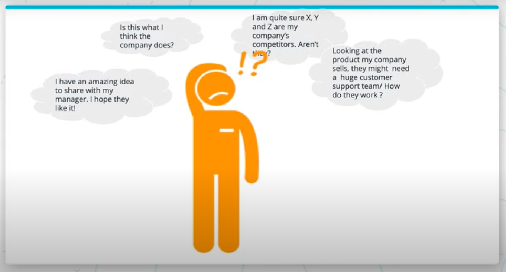
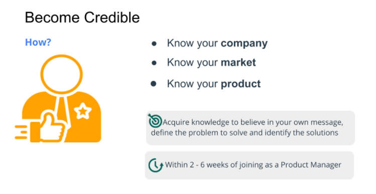
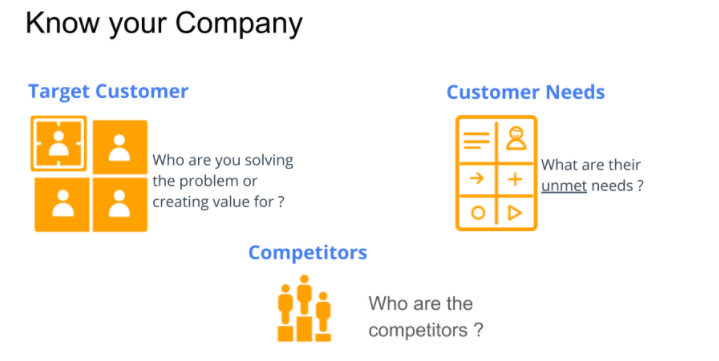
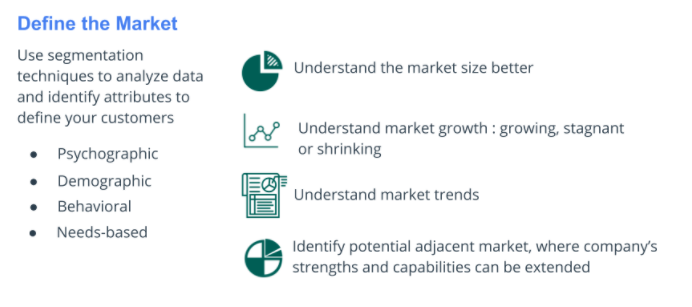
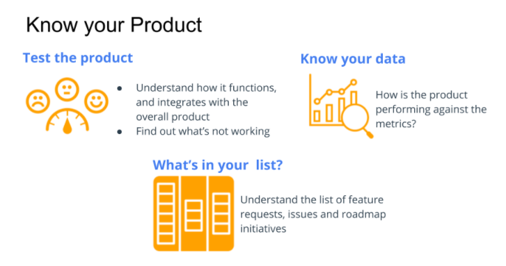
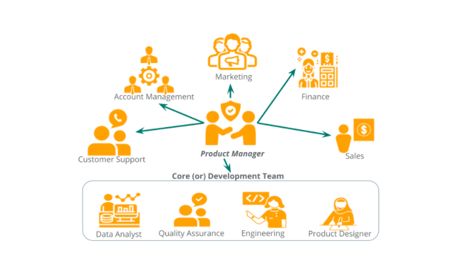
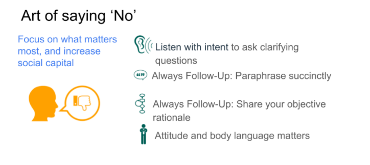

# Table of Contents

a. [Unit Overview: Developing the Product](#Unit-Overview:-Developing-the-Product)  
b. [Lesson Overview: Influencing Without Authority](#Lesson-Overview:-Influencing-Without-Authority)  
c. [Become Credible](#Become-Credible)  
d. [Know Your Company](#Know-Your-Company)  
e. [Know Your Market](#Know-Your-Market)  
f. [Know Your Product](#Know-Your-Product)  
g. [Become Credible: Summary](#Become-Credible:-Summary)  
h. [Build Trust: Overview](#Build-Trust:-Overview)  
i. [Know Your Team and Peers](#Know-Your-Team-and-Peers)  
j. [Build Trust: Summary](#Build-Trust:-Summary)  
k. [Guide the Team](#Guide-the-Team)  
l. [Become a Storyteller](#Become-a-Storyteller)  
m. [Art of Saying No](#Art-of-Saying-No)  
n. [Run Effective Meetings](#Run-Effective-Meetings)  
o. [Negotiation](#Negotiation)  
p. [Coordinate Early](#Coordinate-Early)  
q. [Guide the Team: Summary](#Guide-the-Team:-Summary)  
r. [Lesson Recap](#Lesson-Recap)  
 

# Unit Overview: Developing the Product

Watch [the Unit overview, part 1.](https://youtu.be/6lfk9palA4c)

Watch [the Unit overview, part 2.](https://youtu.be/jcgOZeU9TFg)

 

Goals for this unit:

- `Influencing without authority:` Learn how to influence the team members that you work with either directly or indirectly when you don’t have any authority.

- `Understanding development, methodologies, processes and tools:` Understand the different development methodologies with a deep-dive into the most popular one coupled with how and where your detailed requirements are captured. How do you get your work done effectively across office spaces or locations?

- `Crafting user stories and non-user requirements:` Learn the skills to write users stories with detailed acceptance criteria and also non-user requirements to develop a stable and functional product that is capable of addressing customer needs effectively. Being adept at this helps avoid multiple rounds of back and forth with the product and design team during development.

- `Managing backlogs and stakeholder expectations:` Learn how to track and manage the different types of backlogs that a PM owns and maintains while handling various types of requests that a PM typically receives throughout the day. You'll be handed a list of issues that need to be addressed ASAP or constantly approached by team members across the company about features they desire. You'll learn a simple framework to help prioritize.

 
 

# Lesson Overview: Influencing Without Authority

Watch [the lesson overview.](https://youtu.be/L7IMJr7kQNk)

Product Management is almost entirely a team driven sport. Aside from writing a PRD, nearly every other step involves other team members - and often different ones at different stages.

Some of the essential qualities of an effective PM are: 

- Building and maintaining your social capital (by becoming credible and building trust)

- Essential leadership and team player qualities that you can combine to guide the team

These both sum up as `Earning Social Capital` - a deposit you earn over time when you work with every team member, that you spend to accomplish tasks.

 

Let's think of a real-life scenario. It's been a few months since you joined the company and you're working on an initiative that has been communicated to the company. 

During lunch, your head of sales walks up to you and shares how disappointed they are that you're not working on the feature that their potential clients have been requesting for awhile. 

What would you do here?

 

You could...

- "I'm sorry, that's what I've been asked to do. Please talk to my manager."

- "I don't know what you're talking about. I've been asked to focus on this <x> intiative."

- You ask for details about the requested feature and share rationale on why it was not prioritized - by focusing on the product strategy and goals.

 

If you choose the last options, the head of sales will likely respond with, "All right, I hear you. I'll explain this to the sales team and we'll create some talking points to help them close the deal."

The head of sales understood your rationale and accepted the situation. You spent social capital...to earn more. Social capital is a "currency" that increases in quantity when you spend it.

 

After this lesson, you’ll be able to know what tasks and activities to carry out as a PM after joining a new company and on a continuous basis to become the go-to person for the product you own. Lead your development team, manage stakeholders expectations and setup team members involved in your initiative for success.

 
 

# Become Credible

Watch [How can you become credible?](https://youtu.be/wuV2yQI5deo)

 

 

As a new Product Manager who just joined the company, you will be excited, overwhelmed with a lot of mixed emotions. To prepare for the interview, you had done your fair share of homework on the company, product and probably some of their competitors.

So as a new employee you will have lots of questions and some great suggestions for improvement. But you first need to build trust and become credible in order to have your ideas taken seriously.

 

To become credible, use your first few weeks in the new job as the perfect opportunity to seek answers to your questions with your curious mindset. Validate your assumptions and know who the competitors are. Use this opportunity to gain information about the company, the market it is trying to serve and the product.

In other words:

- Know your company
- Know your market
- Know your product

There is no end date to stop learning but definitely use the initial 2-6 weeks after joining the company to learn the above.

 

 
 

# Know Your Company

Watch [What do you need to learn?](https://youtu.be/7c0aD2e3i_s)

### Start with the Mission, Vision, and Strategy

Knowing your company starts with the mission, vision, and strategy. It is important to understand the company’s purpose i.e what does it exist for, what is it trying to achieve and how does it plan to achieve. This is called a company’s Mission, Vision, and Strategy. 

Depending upon the company’s culture, you will see these printed and posted on the office walls or on their website. The purpose of this is to constantly remind everyone what the company stands for.

 

As a PM though, you need to know more than just the mission and vision in order to align yourself and the team with the company strategy. You'll make impactful decisions daily so you need sufficient knowledge to make progress in the right direction.

There is no point in a beautifully designed product if it doesn't serve the needs of the company's target customer or help the company sell their product.

 

 

Knowing your company goes beyond the mission, vision and strategy. It is about knowing the details that go into defining the strategy to support the company’s mission and achieving the vision.

- Who is the target customer?
- What are the customer’s unmet needs?
- Who are the competitors?
- How does the company create value?
- How does the company grow?

I highly recommend spending the initial 2-6 weeks of joining as a Product Manager to acquire the above knowledge to believe in your own message, define the problem to solve and identify the solutions.

 
 

Throughout this lesson, we'll use the company [Sworkit](https://sworkit.com/) as an example. The name stands for "Simply Work It". 

Take a look at Sworkit's About-Us page to get familiar with a company that talkies about itself very well.

As you explore Sworkit, also think about:

- Who is their target customer?
- What are the unmet needs of the customer?
- What are their needs that are not satisfied by any other alternative in the market?
- How does the company create value?

 

Their mission outlines creating a "significantly healthier" world "by creating a long-lasting, multi-generational impact." They are focused on making fitness "simple, enjoyable and flexible." 

They are "a premium digital health and fitness company founded in 2012" that provides "workouts, customizable plans, and resources" using "strength, cardio, yoga and stretching workouts". They want users to get into the "best shape of their lives, anytime, anywhere".

 

### The Target Customer

There are various components that go into knowing your company better.

- `Who is the company trying to sell?` Who are the target customers? Who are you solving the problem or creating the value for?

Your goal is for customers to want to use your product because they value it so much more than all the other alternatives.

Knowing your target customer helps you narrow your focus and spend time understanding them in particular.

 

Once the target customer is identified...

- `What are their unmet needs?`  The target user's unsatisfied needs are also called `underserved needs`. If you meet these, your target user will be willing to switch to your product.

This picture is incomplete without knowing...

- `Competitors`: the other competitors in your space.

 

Let's practice by identifying these things for Sworkit.

Based on their images and branding used, individual adults look like their target customers.

They seem like time-pressed individuals who want to adopt and maintain a healthy habit for life. There is an emphasis on "anytime, anywhere", indicating the target user is time-pressed. They won't want to spend time commuting to a gym or coordinating for a class or personal trainer.

The user has a willingness and preference to workout outside of gyms and without a personal trainer.

Achieving a fitness goal and sustaining it is not simple.
 We might want to know:

- their level of fitness experience (beginner, intermediate, advanced)
- different type of workouts they want (cardio, weight-based, yoga, stretching, pilates, etc. - they might not have expensive gym equipment at home to use)
- different types of workout plans they want (pre-planned or customizable or create a custom workout from scratch)

 

Knowing these needs, we can already tell that traditional fitness gyms are not the competitor of Sworkit. Time-pressed individuals who want to workout at their own convenience aren't going to consider a gym as an alternative.

Instead, companies with virtual products or fitness equipment with virtual training are competitors.

 
 

### Create Value

`How is value created?` What are the core strengths and differentiating capabilites?

Companies don't operate in a vaccuum, so as the marketplace becomes more crowded with competitors, it's important for the company to also offer differentiating services to keep the customer.

 

`How will these activities create value for the company itself?` How is revenue made? How is the product/service sold? How is success being measured?

As a PM of Sworkit, you would need to be familiar with the app store process -- specifically the requirements to join the app store, and how to get target users aware of the product that will be coming to the app store so they'll download it.

Is it a subscription model? Freemium? Plan-by-plan fee? 

Is the company measuring success by users who sign up and convert to a subscription? Time spent by paid users engaging with the app?

All of this information will help you ask better questions and make decisions with higher confidence.

 

Sworkit _could_ have met user needs by providing workout plans and access to a virtual personal trainer. But they differentiated using a holistic approach, noting that fitness is incomplete without nutrition and community support.

They have HD videos for each exercise, a search function, fitness experience filters, and more. Certified trainers can answer fitness and nutrition questions.

They use a freemium model where users can use the product a few times to understand how the product works and realize the benefits before upgrading to a subscription model.

It uses a monthly fee - or a slight better _annual_ fee.

 

By knowing more about their company mission, competitors and target users, Sworkit customized their product to meet user needs but also differentiated by adding additional features to create a more compelling, useful product.

 
 

Based on your understanding of ‘Knowing your company’ is ‘Upwork’ a competitor of ‘WeWork” ?

No - Their target customers may look similar but they are solving very different problems. In the case of WeWork , they have physical locations across the globe to provide office spaces on a needs basis, while Upwork allows freelancers to be hired by companies from their marketplace

 

As a Product Manager, what information do you need to learn about the company ?

What are the core strengths and differentiating capabilites of the company?

How does the company generate revenue?

Why does the company track success metrics based on 'daily active users' (instead of anything else)?

Knowing this will help you determine what metrics you need to move when product is enhanced. A PM with curious mindset will also question the company’s decision to not focus on ‘engaged users’.

The company's mission statement.

 
 

# Know Your Market

Watch [What do you need to learn?](https://youtu.be/u1i0HHQmgHc)

As a Product Manager, you are tasked with the responsibility to determine what are the best next focused set of initiatives that you and your team should take to progress towards the company and the product's goals. In order to do this effectively you need to understand the market, how is it evolving and what are the opportunities for you to tackle.

 

 

In order to define the market, let’s look at different techniques that can we used to identify key attributes to better define your target customer in the market.

 

`Psychographic Segmentation` is used to categorize people based on their values, interests, opinions, and attitude.

Let’s apply this to Sworkit. If you look at their company, they are trying to cater to individuals who are comfortable with technology and confident to exercise individually within the confines of their home without the need to be in a fitness gym space. This distinguishes their target customer very clearly from those individuals who do not like working out of a home but would rather go to a gym and have a place that is dedicated to exercise.

 

`Demographics Segmentations` is used to categorize people based on race, gender, and other demographic traits.

Demographic segmentation is an outcome of the psychographic segmentation since we now know an individual's sexual orientations. Others can be categorized based on age group, income bracket, and geographical locations

 

`Behavioral Segmentation` is another key attribute that will help you understand user behavior. What action do your customers take, why do they take it and when i.e how frequently. 

In our Sworkit example, the exercisers prefer to work out on a regular basis (could be twice a week, five a week) depending upon a combination of factors such as their fitness level, time available to workout.

 

`Needs-based Segmentation:` The key to success will be understanding their unmet needs that will help you pick the right problem to solve.

 
 

Watch [Evaluating the Market.](https://youtu.be/L5KkIbq8wDw)

Let’s revisit our Sworkit example to understand this better. 

We know that Sworkit exercisers like having a workout routine. What is the definition of a workout routine here? A workout routine could include a specific number of workouts to be completed within a week. This workout routine could be pre-defined or customized but also what goes into each workout matters. 

If the workout needs of the target customers are: 

- As an individual exerciser that likes working out of home, I would like to join other exercisers virtually at the same time to follow the same set of exercises (e.g Zumba ) 

vs. 

- As an individual exerciser that likes working out of home, I would like to start a workout and follow the exercise instructions on my TV screen. 

These are very different needs and there are going to different ways to solve them.

 

`Market Size` 

We can better understand the market size based on the target customer that has been defined using segmentation techniques above.

We can narrow down the market size to individual adults who are willing to use digital fitness products like mobile apps to progress in their fitness journey towards an active and healthy lifestyle in the U.S.

 

`Market Trends`

Next, we want to consider what are the different market trends that affect the company? it could be a combination of different factors such as your customer needs and preferences are changing, technology and advancements in the Fitness is changing. you need to be aware of this. It's important to understand if your identified market is growing or shrinking.

 

`Expand Your Target`

Segment How you expand is very crucial because as a company you're going to have limited resources and time. Define potential adjacent where the company’s capabilities and strengths can be easily extended to create a new product to satisfy a new segment, which will help the company generate additional value in terms of revenue.

 
 

Watch [Understanding your customers.](https://youtu.be/gIEk5k5BhEw)

You can use publicly available data and information available from your company to define the market and understand your customers. All this quantitative data will become more powerful when you actually combine it with qualitative data because this is going to help you understand your customers better and make your storytelling more powerful.

 

### Talk to Your Customers

One of the most often undervalued but powerful tactic is talking to your customers. Interview your customers to gather information about what they do, why do they do what they do? Is their a current alternative product used, what do they like about? Of course, it requires open-ended questions. Spend time understanding your customers. That'll help you unearth rich insights about them.

 

With Sworkit, we talked about individuals needing customized workout plans. You can take this information as a given or go ahead and dig deeper to understand why is this needed. It could be a variety of reasons:

- Someone is going through the recovery process and needs to have a custom-built exercises that help them recover without injuring them further

- Their fitness goal is very specific: improve core strength and become flexible

- Their current workout needs a few exercises to be swapped before they could progress to the next fitness level and utilize a pre-defined workout.

- Observe Your Customers

- Observe your customers. You cannot uncover user-experience focused requirements if you have not observed your target customers in their environment.

 

In the Sworkit example, we will observe our target customers in a fitness gym.

You observe that users take a break for a few minutes and in some instances, a few users started an exercise and skipped it to move on to the next one.

Observing these nuances helps you ask clarifying questions to gather insights such as:

- One user skipped an exercise due to body soreness today while the other needed to take a break for a few minutes before resuming their workout.

These insights cannot be found unless you observe your target customers and talk to them. Then, when you design the product you will add a feature to skip an exercise or pause and resume a workout. When your customer uses this, they will be delighted and probably say ‘ this product gets me. I like it!’

That is a moment for you to rejoice!

 

Knowing your market goes beyond just knowing who your target customer is and their ‘unmet’ needs at a high level. It is about learning the rich details that define your customer using various segmentation techniques and utilizing them to assess the market better

- Define your target customer with rich attributes such as values, demographics etc.

- Understand the dynamics of the evolving market, the trends and how is it growing.

- Make time to understand your target customers: use interviews, focus groups, survey and even observation to gain such insights.

 

Your company is generating more than $25 million by selling ads.You are responsible for showing relevant ads when customers use your website or via emails Do you need to familiarize yourself with regulations and policies such as CANSPAM, CCPA etc?

Yes! Not having the necessary functionality in place (e.g allow users to unsubscribe from all marketing emails easily) to adhere to their guidelines,can potentially affect your company’s reputation and financial health.

 
 

# Know Your Product

Watch [The Approach, Part 1](https://youtu.be/-7pLKPw70yA)
Watch [The Approach, Part 2](https://youtu.be/dnxS0AqxwAY)

The first step to knowing your product is testing the product. A common slang you may hear is `‘dogfooding’`, where the company tests the product that is going to launch to identify and fix issues. In this scenario, there is no product launch but you are testing the product to understand how it functions.

 

Some questions to think about:

- What information is requested from the user on a specific page?
- How long does the page take to load?
- What happens when the product is tested on a cellular network?

 

Another important reason to test is you will understand:

- How does your product interact with other parts of the company's product(s)?

 

Using the Sworkit example here, if you joined their product team, how would you go about getting up to speed on the product?

You might take a look at the images from the app store listing, just like a user would and read the information and reviews. You might download the app and try to create a new account using a non-existent account to read the error messages displayed and try to request a new password. The goal here is to understand how useful or informative are the error messages.

You might try out a few workouts, and see if the summary received was insightful? You might opt into the notifications or reminders and see how they work. Essentially be put yourself in the shoes of a user.

 

By the time you finished testing, you would have formed an opinion:

- Is the product delighting its users?
- Is the product meeting the customer needs? 
- If not, where are the gaps?

The answers to all of these questions and your experience will lead you to your first list of issues and improvements.

 

 

The second most important task is to know how your product is doing. This is where the data comes. Spend time understanding how the data is being tracked and what tools are being used such as [Google Analytics](https://marketingplatform.google.com/about/analytics/), [Mixpanel](https://mixpanel.com/), [Kissmetrics](https://www.kissmetricshq.com/), etc.

Depending upon the analytics platform the company uses, you can understand the user journey within the product to find where do they exist, what do they most frequently use the product for by understanding the tracking events triggered based on the user's interaction with the product.

You may want to analyze data on your own. In order to do this, you need to know the name of the events triggered. For example, when a user clicks on the ‘Sign Up’ button in the mobile app, is the tracking event fired under the name ‘mobile sign up cta’ or ‘mobile sign up submit’. This is an effective way to familiarize yourself with the analytics platform. Use the analytics platform to understand how your product is currently performing. This is going to help you not only identify areas of improvement but also understand how to prioritize issues, what requirements need to be written to implement a new feature

When you utilize the information from testing the product and understanding the right data you will be able to pull the list of feature requests, issues, and roadmap initiatives that will help you identify the strengths and weaknesses of your product. Only then will you understand the feature request, the product strategy, and initiatives more completely.

 

Knowing your product goes beyond just knowing the product strategy and the list of initiatives for you to blindly execute. Test the product and understand how to combine this with information about the market and company to evaluate various types of items ranging from issues reported by users, feature requests to roadmap item effectively. 

Instead of just ‘following the instructions’, become a self-motivated Product Manager who forms opinions based on product working knowledge and data. This is a key trait that is valued in every company regardless of their size and geographical location!

 
 

# Become Credible: Summary

Watch [Becoming Credible.](https://youtu.be/ABHeRVNfWes)

In the last few videos, you learned the three key points to become credible at your workplace:

Use your curious product manager mindset to learn about the:

- company
- market
- product

Build a solid foundation to understand the company’s purpose and its customers better.

Putting in the time during your first few weeks to learn more about your company and product with help you to succeed in your new role.

### Further Reading

 
 

# Build Trust: Overview

Watch [How can you build trust?](https://youtu.be/z9EwOfuxkDQ)

Take time to know your peer's teams. These are the cross-functional team members that you will be working with closely across the different stages of product development.

Get to know your development team well. You will work closely to define what to build, how to build with this team.

 

What do you gain from this?

Good team dynamics make or break a team. Building a strong relationship requires you to understand what everyone does, their challenges, and how you can help each other. 

This lays the foundation for a cohesive team and opens up communication channels to share feedback because the team members know that all of you are working with each other towards a common goal.

 
 

# Know Your Team and Peers

Watch [The Approach to Know Your Team](https://youtu.be/nk7rfiSrbdc)

 

 

### The Core Team

The product manager is shown in the center with a lot of arrows because you are going to be talking to a lot of people!

 

`Product Designer:` you will be working closely with them from the problem definition through the solution phase to launch the product and analyze the feedback. You will also conduct user research to validate both the problem and the solution.

 

`Engineering Team:` You will be partnering with them to define how to solve the problem as you work with the designer.

 

`Quality Assurance Team:` Often referred to as the QA team. This is your partner in crime to break the product that you are building to make sure it works as expected when it gets in the hands of real users.

 

`Data Analyst:` Depending upon the company you may have a data analyst to partner with. These team members provide you with the various metrics: product metrics, company metrics. In order to analyze these metrics, it is important to have them tracked in the first place. You will partner with the data analyst to define the requirements to track the data, test to confirm the requirements are met successfully and set up various experiments as part of the product launch.

 
 

Watch [the extended team](https://youtu.be/pIsFcRyyB9g)

Beyond the core development team a product manager may also interact regularly with:

 

`Marketing:` In some companies, they may be called a product marketing team, adoption team, etc. You partner with this team to determine the activities to be carried out to ensure that the product you're launching is discovered by your customers and adopted successfully

 

`Sales Team:` In some companies, they may be business development, account executives, etc. The sales team needs to understand the product features and their intended benefits clearly to be able to communicate them to potential clients.

 

`Customer Support Team:` Not every single user problem or product issue can be solved in the product immediately. After the product launch, they will be your front line team members interacting with irate customers sometimes and helping them to resolve issues.

 

`Account Management Team:` Their name varies across companies such as client management, customer success, client implementation, and operations, etc. The account managers step in once the product has been sold. They take over the client relationship from the sales team to onboard and continue to manage the client relationship through product upgrades and renewals. You may partner with this team closely to receive customer feedback early on during the solution discovery phase, attend calls to pitch your new product idea, or resolve a major customer concern.

 

`Finance Team:` you will be responsible to make sure their reporting and accounting needs are met. Depending upon the type of company and product you manage your need to partner with finance team will vary.

 
 

Watch [One on Ones](https://youtu.be/p0_Bn5GBLfg)

As a product manager, you have to work with almost every single team in the company If you work in isolation it is going to be very challenging for you to coordinate product launch, know when your product is not working or get someone's help because at end of the day we all need to help each other.

This is where the power of one-on-one meetings come in. You meet with an individual from the peer team that you will be working very closely with and will coordinate a lot.

 

Reach out to your peers that you will work closely with to set up a meeting and then:

- Take time to understand their roles and responsibilities.
    - Know what do they do at the company, specifically what do they do when it comes to partnering with the product team.

 

- How do they collaborate?
    - Understand how they share feedback and new ideas.
    - Are they receiving roadmap updates?
    - Are they being informed about product updates?

 

- What is working well in the current process?
    - This will help you understand what you need to carry out specifically to collaborate with them

 

- What can you do to improve this process?
    - Listen keenly to understand what are they asking and why? Knowing  this will help you identify tasks to address their feedback.

 

- What urgent issues do they believe need to be addressed now?
    - Is this something you can help solve?

 

- Follow up on your conversations.
    - This helps build trust that you were listening and care about what they think.

 

- Set up a regular meeting with them.
    - This helps build rapport with consistent contact.

 
 

Watch [Knowing Your Development Teams](https://youtu.be/j4S-OaKpeoo)

`What existing challenges need to be addressed?` Understand the current product implementation. How is the product built? What are the engineering goals you need to be aware of? From your 1x 1 meeting with the development team members, you gained a sneak peek into how the product has been built and how testing works.

 

`It is essential to understanding the inner workings of both the product and the team.` Meet with them again if needed. We will focus on understanding the engineering implementation and testing process. In your meeting with the engineering lead, understand how the product is built (e.g., architecture design). 

What are the challenges that need to be addressed? Are there any engineering goals to be accomplished? As a PM you are going to be managing a single list of tasks to complete (which is called backlog) and if that does not reflect their engineering goals how can they meet their goal?

 

`Understand the current testing process.` Extend the same philosophy to the QA team member.

How is the product tested?

`Understand how they test a product:` Do they have a combination of manual testing and automated testing? If you used manual testing to try to break the product to know the product, try automated testing. 

Automated testing does not require someone to sit in front of a screen and interact with the product. Automated testing could be done by utilizing a third-party tool or writing scripts that need to be run. 

Let’s take the example of mobile apps that are in IOS and Android: A combination of manual and automated testing is used. It is important to ensure the best user experience is available across all devices and platforms. 

 

`Third-party tools` may be used to verify the user experience across different platforms and devices without the need for a team to maintain an inventory of every device used by the target customers. 

`When is automated testing used?` Some teams automate the verification of existing features to ensure they are not broken when an existing feature is improved or a new feature is added. 

`When is Manual Testing is used?` Manual testing is typically conducted when a new feature is being built and launched, and QA members will test the new feature by interacting with it. Some companies add automation to the new feature as well and may verify critical existing functionalities manually

 

`What existing challenges need to be addressed?`

What are the challenges in the testing process? Some of their challenges cannot be resolved by Product Managers, while others can be. 

Let’s take an example that I have often seen teams run into, and I personally did at the early stages of my career. Many QA team members like conducting exploratory testing for a new product, especially a critical product. 

During my early stint as a Product Manager, when the QA team member had completed their verification, I noticed far more critical issues while testing the product previously gone unnoticed and these got me very frustrated. 

What went wrong here? I met with the testers and shared my feedback, expressed my disappointment in how their testing was not giving the desired coverage. After some back and forth, we realized the real problem was the issues I identified by testing were due to my understanding of how users tend to behave in the real world and their constraints. I had not shared this information in full details with the testers.

 

`Your responsibility as a product manager is to be the eyes and voice of your users to the development team.` Take all the learnings and insights about your customer and their environment and including emotional aspect of the users, so that the tester is able to put themselves in the shoes of the user and various emotions they go through and test the product to find critical issues and provide feedback on the product usability as well. 

 

`Understand their goals.` For e.g., a QA team wants to reduce the number of critical issues that are identified when the product goes live by x % within the next 3 months. Knowing this will help you understand how to coordinate early on and test the product to launch a high-quality product

 

`Unleash the power of One on Ones`

`Set up regular one on ones` to meet with team members in your core team and peer teams. Develop a communication channel where feedback, ideas, and issues can be shared without any concerns because of the underlying trust that binds all of you together. Spend sufficient time knowing how does your core team work and also how is the product built and tested. 

These are layers to the knowledge foundation that you need to be able to collaborate effectively:

- Develop open communication channel between teams
- Know the inner workings of the team
- Gain knowledge and learn to collaborate effectively

 

`Good team dynamics make or break a team.` Building a strong relationship requires you to understand what does everyone do, their challenges in order to determine how can you help each other. This lays the foundation for a cohesive team.

 

Set up regular one on ones to meet with team members in your core team and peer teams. Develop a communication channel where feedback, ideas and issues can be shared without any concerns because of the underlying trust that binds all of you together.

Spend sufficient time knowing how does your core team work and also how is the product built and tested. These are layers to the knowledge foundation that you need to be able to collaborate effectively.

`Start doing this within the first two to six weeks` of joining as a product manager and continue on an ongoing basis.

 

As a Product Manager, how can you build trust? 

- Identify the cross-functional stakeholders that you will work with closely (i.e peers)

- Get to know your team members by meeting with them regularly

- Understand their role and responsibilities especially pertaining to the product you manage

- Understand how is the product built and tested

Don't forget to follow up on items discussed. Always follow-up even if that means informing them that you need some more time. Avoid asking for walkthroughs - this is not required and not recommended since it hinders your objective of building trust directly

 
 

# Build Trust: Summary

Watch [Building Trust Overview.](https://youtu.be/dcHbPb602-g)

 
 

# Guide the Team

Watch [How can you guide the team?](https://youtu.be/3bqku9Rd91o)

`The Art of Storytelling`
    - Create a very powerful and engaging story to communicate your project scope.
    - Get your audience will be able to empathize with your user and their problems.
    - Weave your story to help the audience in connecting the dots between the user and their problem to the product strategy and goals.

 

`Master the Art of Saying No`
    - You should listen to ideas and feedback.
    - Respond according to the product strategy and goals.

 

`Run Meetings Effectively`

    - Make sure decisions are made.
    - Keep the conversation on topic.
    - Be clear on a meeting purpose.

 

`Be an Expert Negotiator`
- Concentrate on achieving a common goal.

 
`Set Everyone Up for Success by Coordinating Well`

    - Create coordination activity maps.

 

`By Guiding the Team you Will be Achieving Better Outcomes as a Team`
    - You should always be guiding the team towards sucess.

 
 

# Become a Storyteller

Watch [How Can you Become a Storyteller? Part 1](https://youtu.be/1NLaE2v_tGA)

Watch [How Can you Become a Storyteller? Part 2](https://youtu.be/Xu-2qLObCTc)

 

Becoming a storyteller means moving away from requirements, numbers and graphs and focusing on the user, their problems and the impact to make it more engaging for the audience to believe in the problem, the proposed solution and impact of solving it.

- What problem is being solved?
- How does it impact the user?
- What is the impact of solving the problem on product strategy and goals?
- What is the solution?

 

As a Product Manager, how can you become an engaging and inspiring storyteller? Order the following information to convey your story best.

| Information | Priority |
| ----------- | -------- |
| Share the list of rejected alternatives along with the reasoning | ? |
| Tie back the impact of solving this problem effectively to the product strategy and goal to emphasize the need to solve this problem now vs. later | ? |
| Transport the audience in the meeting room to visualize the problem that you are trying to solve and highlight the importance of the problem using data and user quotes | ? |
| Walkthrough the solution using a design prototype and avoid reading the requirements document | ? |
| Share information on how is the user affected by the problem and help the audience to empathize with the user by highlighting their motivations, challenges, frustrations etc | ? |

 
 

See the solution...

 

Yay, You got it! It is important to set the context with sufficient details to help the audience empathize with the user and their problems. Before you jump into walking through the solution, it is important to tie back the problem to overall product strategy and goals

 

| Information | Priority |
| ----------- | -------- |
| Share the list of rejected alternatives along with the reasoning | 5 |
| Tie back the impact of solving this problem effectively to the product strategy and goal to emphasize the need to solve this problem now vs. later | 3 |
| Transport the audience in the meeting room to visualize the problem that you are trying to solve and highlight the importance of the problem using data and user quotes | 1 |
| Walkthrough the solution using a design prototype and avoid reading the requirements document | 4 |
| Share information on how is the user affected by the problem and help the audience to empathize with the user by highlighting their motivations, challenges, frustrations etc | 2 |
 

 
 

# Art of Saying No

Watch [Life Skills: The Art of Saying No, Part 1](https://youtu.be/gkeC--pEc0s)

Watch [Life Skills: The Art of Saying No, Part 2](https://youtu.be/4OvJ_dyFK-M)

 

 

You cannot say “Yes” to every idea or feature. Focusing means saying ‘no’ to really good ideas sometimes. 

The delivery of this feedback and how you engage in this conversation is key to guiding the team members without affecting the trust you have built so far or decreasing the earned social capital

 

Let's say an excited team member approaches you with a potential idea for the product you're building. It will happen constantly when more people at the company learn what you're working on.

A common response is, "That's a great idea! But we can't use it." This instantly destroys trust and credibility, and lessens the chance of that team member sharing feedback with you in the future. They'll feel like you won't listen or value their thoughts.

 

Instead, try the following steps:

- Listen with intent to ask clarifying questions
- Always Follow-Up: Paraphrase succinctly
- Always Follow-Up: Share your objective rationale
- Attitude and body language matters

 

Make sure to listen and truly understand `the problem behind their solution`. There's a reason this team member thinks this idea is great - why? Where did they receive the feedback that inspired it?

Then, make sure to reiterate their idea back to ensure you've understood it completely. If you already know that this idea isn't aligned with the product's goals, explain it to them with clear reasoning.

 

`Share your objective rationale` so they understand why you're saying no.

For example, if a team member wanted to add strength equipment exercises to the Sworkit app, like they use in the gym, but the key target user can't afford home workout equipment, let them know that.

> "That idea is not aligned with our product goal of solving the problems and needs of home exercisers because we know that our target customers cannot afford to have gym grade equipment at home.
>
> If they did have those equipments, then they typically hire a personal trainer, which does not require our app to be used.
>
> Moreover, we're helping the exercisers achieve the exact same goal you mentioned, but providing alternative exercises using bodyweight, kettle bells, etc."

 

You can use this opportunity to win the trust of the team by utilizing your knowledge of your market, the customer, company and product; so they understand why their feedback can't be incorporated right now.

 

And if you don't have an answer right away...that's okay. Tell them you'll get back to them soon.

They'll appreciate this answer because it shows that you'll give it thought and value their input.

 

Keep in mind though - none of this matters if your body language is aggressive or condescending! Be humble while delivering the message because you're working together as one team. Positive behaviors lead to positive outcomes. Your tone absolutely matters to have a positive resolution.

 

When understanding _why_ the team member is raising an idea or concern, make sure to remember the customer. Oftentimes, this isn't coming directly from a customer but it's important to remember the voice of the customer, who is the end user and goal.

If you meet with the customer after hearing their feedback from a manager or team member, make sure to `ask the same clarifying questions` -- this helps the customer feel heard and know that you understand their perspective. Even if you are prepared and already know the situation, allow them to explain it again.

 
 

As a Product Manager, how can you guide the team member by saying ‘no’? Order the information to convey the guide effectively.

 

| Information | Priority |
| ----------- | -------- |
| Listen to others with undivided attention | ? |
| Paraphrase by focusing on key details only while distinguishing data-backed information from assumptions and opinions | ? |
| Confirm your understanding with the team member and then proceed | ? |
| Be humble while delivering your response and share the rationale | ? |
| Ask clarifying questions to uncover real issues and gain insights | ? |

 
 

View the solution table...

 
It is important to understand the team member’s idea or feedback clearly and confirm your understanding before you share your response.

 

| Information | Priority |
| ----------- | -------- |
| Listen to others with undivided attention | 1 |
| Paraphrase by focusing on key details only while distinguishing data-backed information from assumptions and opinions | 3 |
| Confirm your understanding with the team member and then proceed | 4 |
| Be humble while delivering your response and share the rationale | 5 |
| Ask clarifying questions to uncover real issues and gain insights | 2 |

 

 
 

# Run Effective Meetings

Watch 

### Further Reading

 
 

# Negotiation

Watch 

### Further Reading

 
 

# Coordinate Early

Watch 

### Further Reading

 
 

# Guide the Team: Summary

Watch 

### Further Reading

 
 

# Lesson Recap

Watch 

 
 