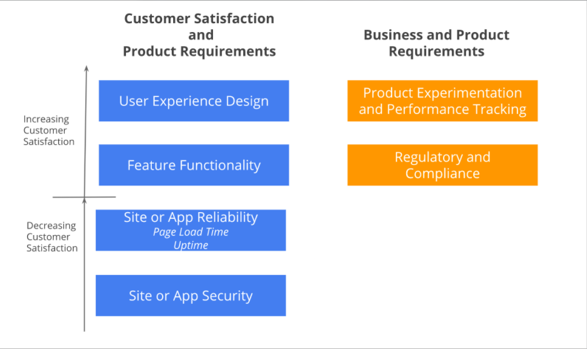

# Table of Contents

a. [Lesson Overview](#Lesson-Overview)  
b. [What is a User Story?](#What-is-a-User-Story?)  
c. [What's in an Acceptance Criteria?](#What's-in-an-Acceptance-Criteria?)  
d. [What are Non-User Stories?](#What-are-Non-User-Stories?)  
e. [Using API Documentation to Define Solutions](#Using-API-Documentation-to-Define-Solutions)  
f. [Become Technical Enough and Plan Work Effectively](#Become-Technical-Enough-and-Plan-Work-Effectively)  
g. [Lesson Recap](#Lesson-Recap)  

 

# Lesson Overview

Watch [The Lesson Overview](https://youtu.be/rdnDAq6smVY)

 
 

# What is a User Story?

For the feature review phase (discussed in Lesson 1), the requirements document captures the initiative scope, its impact on product goals and metrics and the feature details at a high-level. The Scrum team that is involved in developing and testing the product typically refers to the product backlog (discussed in Lesson 2), which contains the prioritized list of features with detailed information to build a feature. It is critical for the feature details from the requirements document to be broken down into manageable chunks that are clear, concise and written from a user perspective. This allows the development and QA team to collaborate with the Product Manager and Designer to discuss the details of how to support the feature based on the proposed design that was shared during project kick-off and updated based on feedback from stakeholders and feasibility input from the development team ( Refer to Coordination Activities Map in Lesson 1)

 

Although user stories are mostly written by Product Manager, the scrum team members, and Product Designer can contribute to writing them as well. However, the Product Manager confirms the details of the user story and acceptance criteria (to be discussed soon) to ensure details are captured for the product backlog correctly. True to the definition of Agile-Scrum methodologies (discussed in Lesson 2), user stories are written and added to the product backlog throughout the feature development

 

A user story is a short and concise feature description written from the user perspective. The template for writing a user story is :

> As a < type of user >, I want to < some goal > so that < some reason >

 

Refers to the person who wants the new capability. It is typically the end-user of the product but depending upon the product for which you are writing user stories, the end-user could be internal to the company such as customer service manager
Captures the user's intent (or) need that they are trying to satisfy (or) job to be done. It does not cover details of 'how' the need is satisfied i.e doesn't refer to the UI design
What is the reason or motivation behind the user's need (or) intent (or) job to be done? This conveys the benefit that user gains when we help them achieve their goal or solve their problem.

 
 

Examples:

- As an exercise, I want to create a custom workout so that I can use it to workout regularly as it meets my specific fitness goal, exercise preferences, and /or body limitations

- As an internal customer support manager, I want to view the custom workout of a specific user so that I can understand their issue better to assist in solving their problem

 

A product has business-driven and system-level requirements that are not user-focused and seems like a misfit for the user-story format. In such scenarios, it is effective to write non-user stories that are simple and focuses on detailing what needs to be done. 

For example:

- Track every single user interaction on every page at the browser and/or device level for Mixpanel tracking

 

 

## Characteristics of a User Story

### INDEPENDENT
Each story is self-contained and not dependent on another story

### NEGOTIABLE
Focuses on capturing a user's needs without restricting how the user's needs are resolved

### VALUABLE
Focuses on providing a clear value to the customer or end-user

### ESTIMABLE
Can be costed during sprint planning to effectively fit into a sprint

### SMALL
Can be developed and tested by the Scrum team

### TESTABLE
Can be tested using the acceptance criteria and definition of done

 

Remember the mnemonic `INVEST`: 
`I`ndependent
`N`egotiable
`V`aluable
`E`stimable
`S`mall
`T`estable

 
 

True or False? To develop products using agile methodologies, all requirements must be written in user-story format.

False - System and business requirements do not make sense to be captured using user stories.

 
 

Now you try it - Pick your favorite product’s feature and write a user story using the format we just learned.

 
 

# What's in an Acceptance Criteria?

Watch [What is in an Acceptance Criteria? Part 1](https://youtu.be/nmgsVjydUVs)

Watch [What is in an Acceptance Criteria? Part 2](https://youtu.be/tAV_Pt-kE2U)

Watch [What is in an Acceptance Criteria? Part 3](https://youtu.be/VJEB3dpKIZ4)

 

A user story’s goal can be met in different ways similar to how a problem can be solved in real life in many ways if constraints, context, and other inputs are not taken into consideration. The most effective way of solving the user's problem or meeting the user's need is captured using acceptance criteria. Acceptance criteria capture a feature behavior in detail from user-perspective

 

1. It helps the scrum team understand what to develop to mark the story as DONE. This minimizes the opportunity for scope creep where the requirements that need to be developed increase mid-sprint thereby affecting both sprint velocity and team’s ability to deliver on the sprint goal

2. Similarly, the acceptance criteria are used by the QA team to confirm whether what has been developed is working as expected

3. The details captured using acceptance criteria are helpful during sprint planning for the team in determining ‘how to deliver’ the user story and story points estimation In summary, acceptance criteria when captured well helps the PM create alignment with internal stakeholders, customers, and scrum teams on how to solve the user's problem or meet their needs.

 

 
 

# What are Non-User Stories?

Watch [What are non-user stories? Part 1](https://youtu.be/L3BYhkhAWp8)

Watch [What are non-user stories? Part 2](https://youtu.be/AnU169j_7jI)

Watch [What are non-user stories? Part 3](https://youtu.be/XqLEeLQFN_U)

Watch [What are non-user stories? Part 4](https://youtu.be/-X24wrfuHpY)

 

Business and system-level requirements that are co-created by Product Manager and engineering are called as non-user stories or non-functional requirements. In some instances, both PM and engineering lead for the project to collaborate with stakeholders (internal and external) depending upon the type of requirements to understand the requirement fully to determine how to support it. An initial checklist to begin capturing these requirements:

- Performance e.g Response time, latency, throughput
- Scalability e.g Scale up, Scale down
- Reliability and Disaster Recovery
- Auditability requirements driven by regulations, legal and compliance
- Accessibility
- Support to run experiments and analytics tracking
- Browser and device compatibility
- Others include Security, Internationalization, etc

 
 

True or False? For a minimum viable product that is being launched to a smaller audience and focused on iterating, the Product Manager need not focus on non-functional requirements to be captured, developed and tested to launch the feature.

False - A product that has fully functional features and delightful user experience will fail if it is unable to load fast, protect user data and handle the user traffic.

 
 

# Using API Documentation to Define Solutions

## Overview

As we all know the number of enterprise customer or consumer use multiple products or applications to complete their desired task or job. For companies to thrive in the complex and competitive world and provide seamless customer experience, speed to market is key to success. Companies integrate with third-party APIs to expand into newer product segments while providing better customer experience. 

API stands for `Application Programming Interface` and it enables products or applications to talk to each other. API is the code that determines whether a product or application can access the server, and what information is it allowed to access or modify. 

Companies expose APIs with supporting documentation for other companies (i.e partners) to integrate. Partners utilize these APIs to launch new features or enhance existing features faster to the market instead of taking multiple quarters or sometimes years to develop it from scratch. Any newly developed functionality that is available via the API can be leveraged with minimal effort by the partners. Some popular third-party APIs that are widely used:

#### Stripe API:

- Process payments by charging a credit card or debit card
- Charge customers on a recurring basis
- Offer discounts to customers for a specific period of time

 

#### Whatsapp API:

- Companies can provide real-time notifications and include documents or images into their message
- Customer can interact with a company or vice-versa
- Encourage customers to provide feedback instantly at the end of service

 
 

Although the partners can save multiple quarters or years of development and maintenance effort, integration with third-party APIs has its disadvantages as well. It is important to not have the entire product dependent or rely on third-party APIs completely. It adds significant risk and dependency on these companies with third-party APIs. 

These third-party integrations are usually available at a cost and some APIs charge on a transaction basis or limit the number of transactions. 

For e.g Stripe offers a standard fee for handling credit card transactions and a discount for large volume transactions. 

This cost cannot be ignored and needs to be considered as part of the development and maintenance cost by you as Product Manager Understanding the basics of an API will allow you as a Product Manager to engage with internal stakeholders, engineering teams, and customers when third-party API integration is being explored or used to provide new functionality and enhance the user experience.

 
 

## What does an API do?

We will focus on understanding the key details that you need to know about an API as a Product Manager. In the case of Technical Product Manager, it definitely goes beyond the information shared here.

 

`REST`: REST stands for `re`presentational `s`tate `t`ransfer. 

A REST API needs to adhere to a set of architectural principles and characteristics. The REST API architecture describes six constraints and these can be learned from the Become Technical Enough Further Research section -characteristics of A REST API. 

At a very high-level, a REST API is resource-based. A resource refers to a thing and nouns are used here. For e.g Plan, Subscription, etc. Representation of the resources (which is a thing) in various ways. When an API call is made from the client to the server, the response contains a representation of the resource. JSON is the commonly used format and XML is also used.

 
 

`Authentication`: Not all products or applications can access an API. You need to have pre-approved access (just like how you need access code to enter some buildings). In the case of APIs, this access code is called the authentication token. 

A company like Stripe or Whatsapp will issue the token and credentials for you to access their API. As part of this, the company will also determine what information and actions are you allowed to carry out (for e.g after entering the building using the access code you can access five floors and use all the tools available). The former is authentication which confirms your identity, while authorization will determine what you are allowed to access and carry out as actions or view information. Username, password and authentication token is required for authentication. OAuth framework is adopted by companies to authenticate and authorize partners

 
 

`Requests and responses`: This is communication that happens between the client and the servers. 

As per the API documentation, a partner can request for information in a specific format and if the partner is authorized to access this information, the server responds with something in return in JSON or XML formation. The API documentation contains information around the different types of requests that are allowed and what can you expect to receive in the response

 
 

`Headers`: Both the request and response will include headers, which contains useful information. 

The header typically includes authorization details, content type i.e how is the information provided to the partner and what content is included, and date indicates the request or response's date and time
HTTP Methods: Partners request for information using HTTP methods ( think of these as commands or instructions with a clear definition of what needs to be done. 

There are many methods, but the most common methods used are: create, read, update and delete information (referred to as CRUD). Some commonly used methods are:

 

`POST`: Used to create a new resource. For e.g company can create a new message using Whatsapp API for a specific customer

`GET`: Read the information you requested from the representation of a resource. For e.g. Retrieve the invoice for a specific customer using Stripe API

`PUT`: Update data. For e.g Update the billing address for a specific customer using Stripe API

`DELETE`: Delete data. For e.g. Delete a customer using Stripe API
Endpoints: It accepts the request from the client to access the API resources. Remember a company can have many endpoints but they need to be exposed for the partners to access. 

 

Let's breakdown a Stripe API's endpoint: 

> DELETE v1/customers/: id

- HTTPS method is `DELETE`
- Endpoint is `v1/customers/: id` used to delete a specific customer
- Returns * an object with the deleted parameter on success, and an error message if the customer ID doesn't exist

 
 

`API calls`: The request made to API is referred to as API calls. When you connect the different details we discussed above, an API call is used to hit an exposed endpoint and if you are authorized to access the API and the requested API, you will receive the information you need. 

In the case of Stripe API, you made an API call to the Delete endpoint with a specific customer ID and Stripe will respond with a success message or an error depending upon whether the customer ID is found or not

 
 

`Payload`: Another terminology used to refer to the response from the API is Payload. The payload refers to the important information you receive in the response that you need to pay attention to since the response contains a lot of information. 

For e.g, the payload from Stripe API to retrieve a specific customer's data will include address, currency, email, and name.

 
 

`Response Codes`: The API response also includes a response code. This code is a numerical value with a specific meaning associated with it. These response codes are meaningful especially to the Product Manager to be able to determine the different scenarios when an API call fails and determine if these failures need to be exposed to the end-user in a more meaningful and actionable format. 

E.g. if the Stripe API call to process payment using a credit card failed due to payment method declined, then the Product Manager can decide to display an error message to inform the user about the same. 

 

Common response codes include:

- `200`: Success. All good!
- `301`: The resource being requested is moved permanently
- `400`: Ran into a client problem. Another common error you may have seen on the website (Oops! 404 Error)
- `500`: Ran into a server problem

 
 

`Rate limiting`: Companies may impose an overall limit on the number of APIs calls a partner can make. This is called Application rate limit/ throttle limit etc. 

This means in some cases if the partner exceeds the maximum number of requests allowed, then the processing may slow down or in some cases return an error indicating the limit has been exceeded. 

Some companies have a tier-based pricing model to accommodate partners with differing needs. 

All the information discussed above and more is captured by companies using API documentation. This documentation will help you and especially the engineering team understand the different functionalities.

 
 

True or False? As a non-technical Product Manager, you are expected to understand the APIs supported using the API documentation clearly to make trade-off decisions, determine features to build and support in the product

False - the goal of understanding the API documentation is to enable you as a PM to engage in meaningful conversation without having to depend entirely upon engineering for every single information you need or to understand what API calls are supported by the company to decide what features can be supported.

 
 

# Become Technical Enough and Plan Work Effectively

As a Product Manager, it is important to collaborate with engineering and build a relationship that places trust in their abilities. This doesn’t mean you as a PM cannot be technically savvy. It simply means you need to utilize the skills to ask clarifying questions, understand trade-offs better, identify potential business opportunities to aid aid decision making. 

Below is a list of additional resources that can help you become technical enough:

 

[Need for Sprint 0](https://www.bmc.com/blogs/sprint-zero/)

[Web Application architecture](https://www.altexsoft.com/blog/engineering/web-application-architecture-how-the-web-works/)

[Native app vs. Hybrid app development](https://codeburst.io/native-app-or-hybrid-app-ca08e460df9)

[Introduction to system architecture design](https://medium.com/backendarmy/introduction-to-system-architecture-design-fcd4f327b6c9)

[Common software architecture patterns](https://towardsdatascience.com/10-common-software-architectural-patterns-in-a-nutshell-a0b47a1e9013)

[REST API Characteristics](https://www.restapitutorial.com/lessons/whatisrest.html)

 
 

# Lesson Recap

Watch [The Lesson Recap](https://youtu.be/eu8p3P3onwA)

 
 