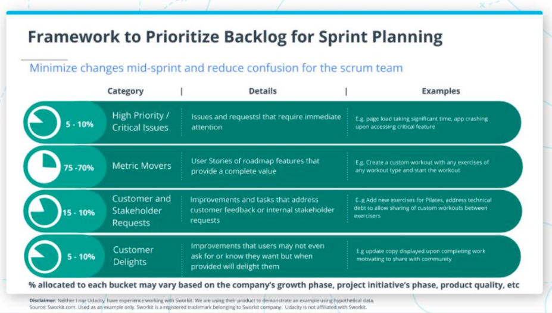
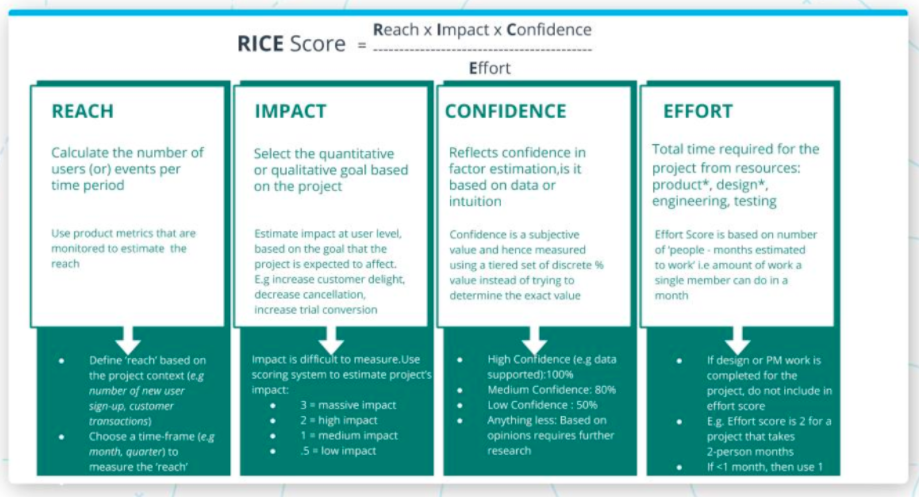
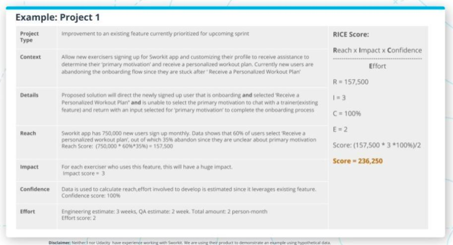
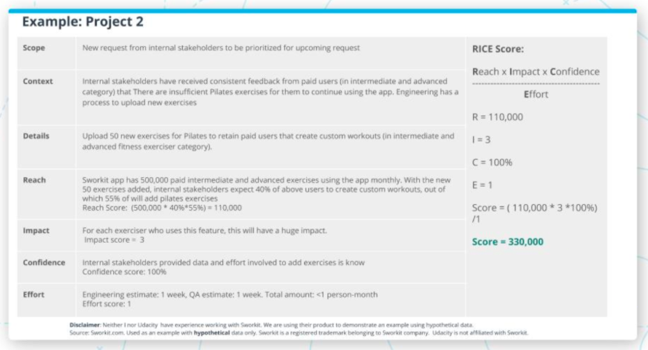
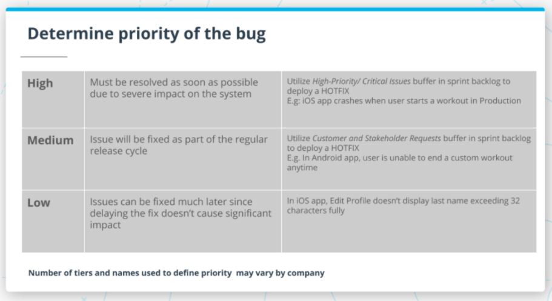

# Table of Contents

a. [Lesson Overview](#Lesson-Overview)  
b. [Prioritizing Product and Sprint Backlog](#Prioritizing-Product-and-Sprint-Backlog)  
c. [Learning Prioritization Frameworks](#Learning-Prioritization-Frameworks)  
d. [Triaging Bugs](#Triaging-Bugs)  
e. [Lesson Recap](#Lesson-Recap)  
f. [Unit Recap](#Unit-Recap)  

 

# Lesson Overview

Watch [The Lesson Overview](https://youtu.be/5uZSs4Mce0M)

 

As a Product Manager, you will often end up dealing with multiple requests and different competing priorities throughout the day. By learning how to evaluate these different types of items in a consistent way using a prioritization framework, you will be able to manage different types of backlog such as product and sprint an also manage stakeholder expectations effectively.

 
 

# Prioritizing Product and Sprint Backlog

Watch [Prioritizing Product and Sprint Backlog: Part 1](https://youtu.be/ULq4AzDVsqQ)

Watch [Prioritizing Product and Sprint Backlog: Part 2](https://youtu.be/6RU7a_KxLho)

Watch [Prioritizing Product and Sprint Backlog: Part 3](https://youtu.be/LIIKP476jDU)

Watch [Prioritizing Product and Sprint Backlog: Part 4](https://youtu.be/J07Ng2X9im4)

Watch [Prioritizing Product and Sprint Backlog: Part 5](https://youtu.be/jawPObC9Jk4)

 

 

Effective prioritization is key to maintaining a balance between developing and launching roadmap initiatives, addressing customer requests (including internal stakeholders) and bugs. A prioritized product and sprint backlog help you (as a PM) stay on track to meet product goals while handling issues that arise constantly and keeping the development team focused on building what matters the most.

 
 

True or False? If your product is stable and hardly gets any high priority issues address, Product Manager can utilize the High- Priority/Critical Issues buffer to complete more of the roadmap initiative scope.

True - What has been completed at the end of a sprint may vary if there were higher priority issues /requests that had to be addressed mid-sprint. Moreover, not all of the sprint deliverable is released to the production. This requires communication at the end of the sprint.

 

True or False? It is sufficient to broadcast the sprint backlog at the beginning of the sprint to manage stakeholders expectations successfully.

False - What has been completed at the end of sprint may vary if there were higher priority issues /requests that had to be addressed mid-sprint. Moreover, not all of sprint deliverable may be released to customer and helping stakeholders understand this clearly requires communication at the end of the sprint.

 
 

# Learning Prioritization Frameworks

An effective prioritization framework helps the Product Manager identify key factors to consider while evaluating a feature request or project. When these factors are then combined methodically to calculate a score for the project or feature request under consideration,different ideas can be compared with each other in a consistent manner. 

The RICE scoring model developed by Messaging-software maker INTERCOM is one such framework. It is designed to aid Product Managers compare different items (roadmap initiatives, feature requests, new ideas) by scoring them based on four factors: reach, impact, confidence, and effort. The framework enables Product Manager to make objective decisions that are void of personal biases, and defend their rationale (remember Art of Saying “No’) in front of stakeholders

 

 

 

 

Below is a list of commonly used prioritization techniques:

[Kano Model](https://www.mindtheproduct.com/using-the-kano-model-to-prioritize-product-development/)

[Cost of Delay](https://www.productplan.com/product-manager-cost-of-delay/)

[Weighted Scoring Prioritization](https://www.productplan.com/glossary/weighted-scoring/)

 

Prioritization Frameworks enable you as a Product Manager to handle competing priorities and make objective decisions that are void of personal biases and give your team a prioritized backlog to focus while delivering value to customer and building a winning product

 
 

# Triaging Bugs

Watch [Triaging Bugs: Part 1](https://youtu.be/J4I_sNGCyuc)

Watch [Triaging Bugs: Part 2](https://youtu.be/scxFpEjO-XU)

Watch [Triaging Bugs: Part 3](https://youtu.be/9ztvU8iR_QQ)

Watch [Triaging Bugs: Part 4](https://youtu.be/isJOsQr8HhY)

Watch [Triaging Bugs: Part 5](https://youtu.be/bKxKHaHuaak)

Watch [Triaging Bugs: Part 6](https://youtu.be/ptnam-0_dlQ)

 

 

 
 

What is a bug and why does it matter?

A bug is an issue that prevents the product from behaving or functioning as designed. This is different from the product behaving in a way that the users don't expect it to. 

Let’s take an example: In the Sworkit app's exercise library each exercise has a video demo in a loop with instructions to read. When the same exercise is part of an active workout, it has audio instructions. It may be designed intentionally this way since exercisers browsing the exercise library can read the instructions while exercises working out cannot. If an exerciser reports an issue that audio is not playing on the exercise details page, I recommend understanding the user's reasoning.

 

A common misconception is new functionality development trumps bug fixing. This is not the case since Product Managers evaluate the bugs on a case by case basis to determine whether the bug needs to be fixed now vs. later. The first step is confirming whether the reported issue is a bug or a mismatch in user expectations. If the reported issue is a bug, then determine whether it's reproducible every time. Let’s take an example: Imagine using any messaging app and you are unable to include an emoji in the text. When you tap on the emoji it shows as selected but doesn’t appear in the text you typed. This issue is reproducible every time an emoji is selected regardless of whether the user tries to add it at the beginning, mid-sentence or end of the sentence.

We will spend the next few minutes understanding how does an issue's severity determines the priority to fix the bug.

 
 

Bugs can neither be avoided or eliminated fully in a product.As a Product Manager, you can partner with QA to understand the severity of the issue and collaborate with stakeholders to finalize the priority. Once the priority is determined, utilize the ticketing tool (work management tool) to reflect the priority and prioritize the issue to be addressed. 

It is important to maintain the feedback loop with stakeholders anytime there is a significant upgrade or degrade in issue priority, a high priority issue is prioritized mid-sprint and fixed. For bugs that arise due to technical debt accrued over time, it is important for the Product Manager to measure the negative impact of not addressing the bug by collaborating with the scrum team to determine the priority. 

The negative impact is mapped to a metric or goal that the product, business or engineering, and QA team are tracking actively. Although there are many factors taken into consideration to determine the timeline to resolve the issue, factors such as the risk of delaying the fix and minimize throwaway work are commonly used to fix the issue either in a phased manner or using a combination of short-term and long-term fixes.

 
 

True or False? It is sufficient if the Product Manager informs the stakeholders that are high-priority issue has been added mid-sprint with details around timeline to address, impact etc.

Yes - Sometimes low-severity issues are prioritized as high based on factors such as reputation risk. This may be fixed as a hotfix as well.

 

A company updated their logo branding and on the day the announcement was made the logo on the product was updated. The logo has incorrect color and font used. Does it need to be fixed ASAP ?

False - Closing the communication loop is critical in such instances and is important to follow-up once the issue is addressed with plan to avoid future occurrences.

 
 

# Lesson Recap

Watch [The Lesson Recap](https://youtu.be/Uz9EopGhZiI)

 
 

# Unit Recap

Watch [The Unit Recap](https://youtu.be/YA6wBWS91h0)

 
 