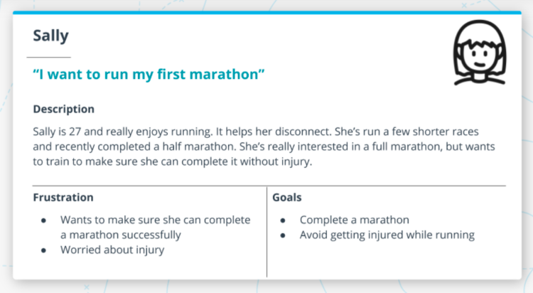
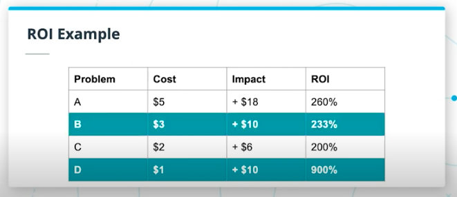

# Table of Contents

a. [Lesson Intro](#Lesson-Intro)   
b. [Identifying Opportunities](#Identifying-Opportunities)   
c. [Understanding the Market](#Understanding-the-Market)   
d. [Exercise: Industry Trends](#Exercise:-Industry-Trends)   
e. [Solution: Industry Trends](#Solution:-Industry-Trends)   
f. [Target User](#Target-User)   
g. [Exercise: Target User](#Exercise:-Target-User)   
h. [Solution: Target User](#Solution:-Target-User)   
i. [Total Addressable Market](#Total-Addressable-Market)   
j. [Exercise: TAM](#Exercise:-TAM)   
k. [Solution: TAM](#Solution:-TAM)   
l. [ROI](#ROI)   
m. [Creating and Evaluating Hypotheses](#Creating-and-Evaluating-Hypotheses)   
n. [Build a Business Case](#Build-a-Business-Case)   
o. [Lesson Recap](#Lesson-Recap)   

 
 

# Lesson Intro

Watch [the lesson intro](https://youtu.be/5SJ9sJ5WMyo).

One of the most important aspects of being a Product Manager, and one of the areas they spend the most time on, is making sure that you are solving the right problems. They have to identify not only what _to_ solve, but also what _not to solve_.

 

In this lesson, we’ll cover the following topics:

- Identifying Opportunities
- Understanding the Market
- The Target User
- Total Addressable Market
- Creating & Evaluating Hypotheses
- Building a Business Case

 

At the end of this lesson, you’ll be able to:

- Identify problems that are worthwhile to solve
- Understand the market through research
- Identify your target user and build user personas
- Calculate the total addressable market (TAM) for your product
- Calculate the return on investment (ROI) for solving a problem
- Define hypotheses about your product that need to be validated
- Test your hypotheses by putting them in front of users
- Understand the components required to build a business case

 

### Glossary

| Term | Definition |
| ---- | ---------- |
| Efficiency Gain | Something that results in a process being less expensive to complete (shorter amount of time, less money, etc). |
| TAM (Total Addressable Market) | A measure of the revenue opportunity for a product. |
| ARPU (Average Revenue Per User) | The average amount of revenue you receive for each user you have, usually measured by year. |
| ROI (Return On Investment) | The ratio between the net profit and amount of investment. A high ROI indicates more impact with less effort. |
| Payback Period | The amount of time that it takes for a product to recoup the initial investment required to build it. |
| Focus Group | A small group of people you can present concepts to in order to see how they react. Generally this will be a diverse group of people and you will have specific questions you’d like to get their feedback on. |
| Target User | A representation of a group of users with shared characteristics. |

 
 

# Identifying Opportunities

Watch [Identifying Opportunities](https://youtu.be/kB4z_8GIGgo).

Finding the right problem to solve is critical for the success of your product! 

If you aren’t focusing on the right problems, your product will fail. 

This is something that both big and small companies struggle with. You’ll have to work through constraints and tradeoffs to get this right.

 

So how do you figure out which problem to solve?

### Research

`Market Research` is helpful to understand the current space, what products already exist, what the competition is like, and what are the trends.

`User Research` comes in many different forms, like interviews and focus groups. It's critical to go out and talk to users. It's the best way to understand their needs and problems.

 

### Product Data

If there is already an existing product and you're looking to create an add-on or follow-up product, the additional data that already exists on the current product can help you understand what problems current users have. By seeing how they're using (or not using) the product, you can identify potential ideas for new features.

 

### Support Data

Support data tells you which kinds of issues users are already running into, to reduce bad experiences with customers and the amount of money the company spends on providing support.

 

### Efficiency Gains

These are things that will allow you to scale and provide more value over time. If there's a manual process the engineering team has to do, automating that process frees up bandwidth for the team to solve more problems. 

 

There are additional challenges, like constraints and tradeoffs.

`Time is limited` - by the hours in a day and the number of team members the company has. Not everything is physically possible to accomplish.

`Different Impact` can determine which problems are more important to solve. A product with negligible impact is likely not worth solving. You need to prioritize the impact your team can have, not just for the user, but also the company.

If products don't meet business goals, the product could be killed or the company could go out of business.

 

Business goals might look like increasing or decreasing some of the following:

- Revenue
- New Users
- Engagement
- Costs
- Churn

These will need to be evaluated when you create a business case.

The best product opportunities solve user problems and meet business goals. You want to find overlap between both areas to identify the best problems to solve.

>> "You can change everything in your startup except the market. So spend a lot of time up front to make sure you've thought through your market." - Sam Altman

If your product doesn't solve a problem that resonates with the market, it won't matter how amazing that product is.

 
 

# Understanding the Market

Watch [Understanding the Market](https://youtu.be/ktgHrSBrJkI).

Understanding the market is critical to building successful products. Some markets are better than others. And some products do a better job than others. 

You’ll want to make sure that your product satisfies the needs of the market.

 

What is product market fit?

>> "Product/market fit means being in a good market with a product that can satisfy that market." - Marc Andreesen

Understanding the market allows you to focus on solving the right problem. Keep in mind that some markets are better than others.

 

So what makes a good market?

`Size`: How many people have this problem?

`Growth`: Is the size of the market increasing?

`Acquisition`: How easy is it to gain new customers? How much friction is there for a customer to switch to your product? How easy it is to explain your product's differentiation? How much does it cost to acquire customers?

 

What are some signs that there is no product market fit?

- `Users aren't getting value` which causes second order effects: like... 
- `No word of mouth`: they aren't recommending or talking about your product
- `No press buss`: there's no excitement around the product within the press
- `Slow growth` that makes it difficult to sell your product.

On the flip side, when product market fit is good, you'll see these signs:

- `Users get a lot of value` from your product that is solving an important need for them
- `Product practically sells itself` because it's so great. Users recommend it to others. It's easy to immediately understand the value and why someone would pay for it
- `Press excitement`: the press is reaching out to talk to you about your product
- `Product in high demand`, it can sometimes be difficult to keep up. For example, needing to add more servers to support your app.

 

To better understand the market, you’ll want to talk to your users and customers. But before you do, you can look at some of these things to get more familiarity with the market:

- `Online research` to better understand what's happening in the market
- `Headlines & News`: staying up to date on relevant news to the problem you're focused on
- `Similar products` to see how they've approached the problem, what's working well and what they're struggling with
- `Trends`: like Mary Meeker’s annual Internet Trends report. [Google Trends](https://trends.google.com/trends/?geo=US) can also be a helpful tool to see what people are searching for, and how that's changing over time.

 

### Further Research

[Mary Meeker's Internet Trends](https://www.bondcap.com/report/itr19/)

[12 Things About Product Market Fit](https://a16z.com/2017/02/18/12-things-about-product-market-fit/)

 
 

# Exercise: Industry Trends

[The Exercise](https://youtu.be/cI-DUNi-Pjg).

Imagine that the team is interested in building a product to help people better track their fitness and improve their health over time. 

Spend a little bit of time doing some research to better understand current trends in the fitness tracking market.

Here are some questions to get you started:

- What benefits does improving fitness provide?
- What products are already in the market?
- How much do people spend on health/fitness?
- What are the different ways to deliver fitness tracking? What are the pros and cons of each approach?

 
 

# Solution: Industry Trends

Watch [the solution explained](https://youtu.be/_83lNbh4Dzk).

### Benefits
- Controls weight
- Combats health conditions & diseases
- Improves mood
- Boosts energy
- Sleep better

 

### Existing Products
- Smartwatches
- Apps
- Smart Ring

 

### Spending
$155 / mo
$1,860 / yr

| Category | Amount |
| -------- | ------ |
| Supplements | $56 |
| Clothing | $35 |
| Gym | $33 |
| Meal Plans | $17 |
| Trainers | $14 |

 
 

# Target User

Watch [Target User](https://youtu.be/-J4wBKUyXF0).

Identifying a target user is important, because it makes it very clear who you are building the product for. 

Oftentimes, a problem will best be solved in different ways for different types of users. 

Identifying a target user creates focus and lets you zoom in on solving the needs of that specific target user.

 

You would build a different calculator for a grade schooler vs a scientist, because they have different needs and goals that the calculator would need to accomplish. Plus, they have different purchasing power. 

Keeping your target user in mind helps answer questions about what the product is and can do.

 

To define your target user, you want to identify users with shared characteristics who would be interested in your product.

You can do this by collecting data, like market research, interviews, surveys, focus groups, existing customer data, and more.

Once you have the data, you'll need to identify trends in user characteristics like:

- `Demographics:` how old is your user? where do they live?
- `Motivations:` what gets them excited?
- `Goals:` what are they trying to accomplish?
- `Frustrations:` where are they running into current problems and challenges?

 

Then you can create `user personas` to represent the target user. The user persona is a fictional person that you create who might use the product. As you develop the product, you'll refer back to your persona to stress test and challenge some of your ideas.

"Does this decision solve Sam's frustration? Would Sam be able to afford this product?"

User personas also allow you to weave in storytelling when explaining objectives and motivations to team members and stakeholders. Storytelling is a more powerful way to show the meaning behind a goal or mission. It brings the target user to life, to build empathy across team members who may not speak with real customers.

 

To create a user persona:

-  `Give the persona a name:` a great method is to use alliteration, and have the fictional last name describe an attribute of the target user: `Sam Student` or `Dan Driver`.

- `Add a photo` or illustration of what this user might look like

- `Add a quote` with a key insights about this user. It can be powerful to incorporate real quotes from users you've spoken to during user research.

- `A description` of that user, painting a story about who they are. It doesn't have to be in-depth -- just focused on things that are relevant to the product.

- `Frustrations or challenges` that the user is facing -- like a busy schedule impacting time management. 

- `Goals` that the user has, which the product helps them to achieve.

- `Motivations` that will help shape the product, like "Sam wants to share progress with friends and family," which indicates simple exporting or social sharing would encourage the user to stay engaged with the product.

 

 

### Further Reading

[Are You Ready to Change Your Target Customer?](https://hbr.org/2019/03/are-you-ready-to-change-your-target-customer)

[How to Define Your Target Market: A Guide to Audience Research](https://blog.hootsuite.com/target-market/)

 
 

# Exercise: Target User

Watch [Target User Exercise Outline](https://youtu.be/5VO5gqXjaTE).

Given the market research that you’ve done so far, create 3 user personas for a fitness tracker. 

Keep in mind, that in the real world you would also want to make sure that you get data from real users through interviews or surveys before building any personas. 

For each persona, create a name and some information about them. Also include their frustrations and goals.

Then, we’ll regroup and walk through the examples that I created.

- [ ] Create three target user personas. Make sure to include the user’s name, a quote, their description, frustrations, & goals)

 
 

# Solution: Target User

Watch [the solution walkthrough](https://youtu.be/FfLM7BJLMSI).

The example solution user personas might look like...

 

 

 
 

# Total Addressable Market

Watch [Total Addressable Market](https://youtu.be/np3ObqHG1F8).

TAM, or total addressable market, is a measure of the revenue opportunity for a product. 

Keep in mind that TAM is not a measure of your revenue or future revenue. Instead, it allows you to understand the size of the market if you had 100% of the market. 

A larger TAM indicates a larger opportunity, with more demand for a particular product. 

However, just because there’s a large TAM does not mean that a product is guaranteed to be successful… There are lots of other factors that will come into play, like competition.

 

`TAM` = `Average revenue per user` X `total number of potential users in the market`

 

There are several approaches to calculating TAM:

### Top Down Method

Top Down uses industry research to estimate the size of an addressable market.

You start with a high macro-level view of the economy, and then narrow that down based on factors like demographics. This goes all the way down to your target user. 

You usually will start will everyone in the world and narrow down that audience to people who are interested in your product.

 

For example, how would we find the TAM for bottled water in the US?

There's roughly 7.8 billion people on Earth, of which 330 million live in the US. Each person needs about 2 liters of water per day. We'd charge $1 per liter.

`330 million people` X `2 liters per day` X `$1 per liter` X `365 days per year` = $241 Billion

 
 

### Bottoms Up

Bottoms Up involves using known data points that you have (data from early customers and sales -- or theoretical) that you could extrapolate to represent a larger market opportunity. 

If we were already selling bottled water in California, but wanted to expand to the rest of the US, we need to understand the TAM.

By looking at existing sales, we can scale it.

 

For example, we currently sell 10 million liters of bottled water per day at $1 per liter.

There are about 40 million people in California which indicates 25% of the population buys 1 liter from us daily.

The TAM in California is $3.65B = (40 million people) X (25% of people) X ($1 per liter) X (365 days per year)

If we apply the same statistics to our larger prospective market, we can find the TAM for that expansion.

(330 million people) X (25%) X ($1 per liter) X (365 days per year) = $30.1B TAM in US Sales

Because we already had insight into how many people actually purchase bottled water, our estimates are less crude than in a Top Down approach.

 
 

### Value Theory

Value Theory is generally used for brand new product categories where you don’t have much information to base estimates on. 

This involves conducting market research to understand:
- How much are people willing to pay for your product?
- How many potential customers would purchase the product?

This requires conducting extensive user research to find out what people would pay and how many potential customers you might have.

 

### Further Reading

[How to Calculate Your TAM and Make Slides for Investors](https://www.forentrepreneurs.com/calculating-tam/)

 
 

# Exercise: TAM

Watch [the TAM exercise overview](https://youtu.be/MKSdoICmFVg).

Calculate the TAM for streaming media services in the US. 

- [ ] Use online sources to quickly research streaming media services
- [ ] Identify the potential number of people that can use the product
- [ ] Identify an estimate for the cost of the product
- [ ] Calculate the TAM

 
 

# Solution: TAM

Watch [the TAM solution walkthrough](https://youtu.be/SRjhxRjLIXg).

Using the following information, we might estimate the TAM for streamin in the US to be roughly $15.6B.

 
 

# ROI

Watch [ROI](https://youtu.be/suhaUfF1lZk).

ROI is a way to measure the efficiency of an investment (like deciding to build a new product or feature). 

Understanding and calculating ROI for different problems will help you to understand where to focus your team’s time in order to have the biggest impact.

Calculating ROI and payback periods are two important tools to help you understand if it makes sense to solve a problem. 

 

We can think of calculating ROI with the following equation:

> (amount gained - amount spent) / amount spent

 

Amount gained doesn't just reference increased sales -- it can also include amounts saved by increased efficiency. The key is to make sure that impact is able to be measured in dollars, even if just as an estimate.

 

Projects with positive ROIs will cover the investment required to build the product… Projects with negative ROIs will not and won’t make sense to pursue. 

Calculating the payback period allows you to understand how long it will take before the product recoups the upfront investment required to build it.

 

ROI calculations can be very difficult to calculate, so work with someone on the finance or data science team, to ensure your estimate is accurate.

Another way you may need to look at ROI calculations is with this formula:

> (impact - cost of development time) / cost of development time

We can estimate the cost of development time based on how many people are involved and how long it takes to complete the project.

 

Let's imagine there are four problems that we want to solve, as in this chart:

 

 

Let's assume that each problem has a `Cost` and you have a budget of `$5` to spend on problem solving. How can you determine the best value for spending that $5?

Based on the estimated impact, we can determine the right problems to solve.

At first glance, problem `A` seems like the best value -- it has a high impact ($18) despite using the entire budget.

But if we look at solving problems `B` and `D`, the impact would be higher ($20) for only $4 of our total budget.

Let's calculate the ROI for problem `D`:

> (impact - development cost) / development cost
> (10 - 1) / 1
> 9 / 1
> 9.00 = 900%

If we calculate the ROI for each problem, we can more easily see where our budget could be spent on the best overall value.

 

 

If we solve problem A, we can have 260% ROI. If we solve problem B and D, we can have 1133% ROI.

 

### The Payback Period

The payback period is the amount of time that it takes to regain the initial cost of building the product. This can be calculated like so:

> Cost / (impact / time) = Payback Period

Payback period can impact our decision about which problem to solve.

If we look at our original A, B, C and D problems, and calculate the payback per year and the overall payback period, the chart would look like this:

 

 

This is another tool to help determine what problems are worth solving. Projects with a positive ROI will cover the investment that it takes to build the solution. The payback period can then help determine how long it would take the company to recoup that upfront investment.

Depending on the company's business goals, choosing a less impactful project with quicker payback would be prioritized over a more impactful, long-term project.

 

### Practice

Can you fill in the rest of this chart?

| Problem | Cost | Impact | ROI | Per Year | Payback Period |
| ------- | ---- | ------ | --- | -------- | -------------- |
| A | $10 | + $20 over 2 years | ? | ? | ? |
| B | $40 | + $70 over 7 years | ? | ? | ? |
| C | $75 | + $100 over 4 years | ? | ? | ? |
| D | $100 | + $150 over 3 years | ? | ? | ? |

 
 

### Solution

 
 Expand for the solution: 

| Problem | Cost | Impact | ROI | Per Year | Payback Period |
| ------- | ---- | ------ | --- | -------- | -------------- |
| A | $10 | + $20 over 2 years | 100% | $10 | 1 year |
| B | $40 | + $70 over 7 years | 75% | $10 | 4 years |
| C | $75 | + $100 over 4 years | 33% | $25 | 3 years |
| D | $100 | + $150 over 3 years | 50% | $50 | 2 years |

 

We can determine this like so, for Problem B:

> (gain - cost) / cost = ROI
>
> ($70 - $40) / $40
>
> $30 / $40
>
> 0.75 = 75%

 

The per year payback:

> gain / time to recoup  
>  
> $70 / 7 years  
>  
> $10 per year  

 

The Payback Period to recoup the initial investment:

> cost / (gain / time to recoup) 
>  
> $40 / ($70 / 7)
>  
> $40 / $10
>  
> 4 = 4 years

 
 

# Creating and Evaluating Hypotheses

Watch [Creating Hypotheses](https://youtu.be/80Vx9sKJ_Jo).

Before you build a product, you want to be sure that it will be successful. 

You can create hypotheses to make sure that your assumptions about your product are correct -- and that you are solving a real problem for real people. 

After creating your hypotheses, you can test them to see if they are true / still accurate in the real world.

Your hypotheses should be based on what you know so far. 

Focus basing them on the following aspects:

- `Customer needs:` what are the specific goals your customers are trying to reach? Where is there an opportunity for you to help them reach those?     
    > "Is this a real problem?" 
    >
    > "Is there urgency in finding a solution for this problem?" 
    >
    > "Is this a painkiller (immediate relief) or a vitamin (a nice to have)?" Does this problem require a painkiller? If there is no urgency required, it's likely the product will fail.

- `Your solution:` Does your specific solution meet that customer need? 
    > "Does it really solve the problem?"
    > 
    > "What alternatives does the customer have?"
    >
    > "Is your solution way better or roughly the same?"

- `Differentiation:` Is your solution differentiated from other solutions out there?
    > "Is it different?"
    >
    > "How is it different? What does it do that other products don't?"

- `Value:` Does it create enough value for users that they're willing to pay for it?
    > "How much will people pay for it?
    > 
    > "WHat can you do to increase their willingness to pay?"
    > 
    > "How much do people currently pay for alternative solutions?"

 
 

### Testing Hypotheses

Watch [Evaluating Hypotheses](https://youtu.be/Zhzy4hs4upI).

You can test and evaluate your hypotheses in several different ways. These are great to setup and run with a researcher who can help mitigate bias:

- `User interviews:` talk to users, walk them through your thinking, and get their feedback. This works best with a prototype that users can evaluate to determine if they would use it, would buy it, and why or why not?

- `Focus groups:` having a conversation with a group of users in a room at the same time. Because they interact with each other, they'll build on top of each others' ideas, disagree and provide alternative views. Be careful of group thinking, where only one opinion surfaces within the group.

- `Surveys:` For higher level questions, this returns feedback at a larger scale, but is limited on how deep and interactive you can be with the user. You'll get some insight, but not as detailed as an interview. 

- `Design sprint:` This stress tests the way the problem is framed and to help design a solution. This is then validated in front of real users who provide more feedback.

 

If you find that:

- You are not addressing a customer need
- Your solution isn’t providing value
- Your product isn’t differentiated enough
- There’s no willingness to pay…

*Stop.* It’s not worth pursuing this idea in its current form because you won’t have product/market fit. 

You should go back and tweak which customer you are focusing on... or your solution... Or your pricing model.

Before you build a product, you want to be sure that it will be successful. Having data to back up your solutions is key to developing a product.

Creating hypotheses around the problem, your solution, differentiation, and value and then testing them is a good strategy to make sure that you find product/market fit.

 
 

### Further Reading

[Product Development Through Hypotheses](https://www.etventure.com/blog/product-development-through-hypotheses-formulating-hypotheses/)

[Customer Development with Steve Blank: Hypothesis Testing](https://www.startups.com/library/expert-advice/customer-development-steve-blank-hypothesis-testing)

 
 

# Building a Business Case

Watch [Building a Business Case](https://youtu.be/4BTU_RiUI3w).

After creating and evaluating your hypotheses, it's important to build a business case to relate why the team should spend the time and money on building this product.

 

A business case answers the question: 

> “Why should the company do/invest in this?”

The goal is to convince sponsors/stakeholders to approve the project. 

You won’t always need to go to this level of detail for all projects, like a new feature in an existing product. For smaller projects, the PRD will likely have enough detail. 

But for an entirely brand new product that you'll build from the ground up, you will need to be able to justify the larger investment. 

> Is it worth continuing this project?

 

A business case should include:

- `Business problem`
- `Benefits`
- `Costs`
- `Risks`
- `Possible solutions`
- `Timeline`
- `Competition` overview

For new product investments it’s important to build a business case, which answers the question: 

> “Does it make sense to build this?”

 

Your business case should be organized into the following sections:

### Executive Summary 

The Executive summary summarizes the entire document, including the recommendation. 

You want to make sure that it has enough detail that if it’s the _only_ thing people read they will understand the justifications for building the product. 

Even though it’s usually the first thing people read, it should be the last thing you write to make sure that everything is cohesive.

 

### Problem Statement 

The Problem Statement explains the problem you are trying to solve, as well as the associated goals. 

> What is the problem?
>
> Why does it matter?
> 
> Why is it important to solve?
>
> How does this connect to our business goals?

It should also clearly link the problem back to the business strategy and goals.

 

### Analysis of Product Opportunity 

In the Analysis of Product Opportunity section, you discuss the merits of why solving the problem is important. 

> Why is this important for the business to address?
>
> What is the cost of ignoring this problem?
> 
> What is the size of the opportunity?

You’ll usually want to touch on the cost of the problem and the size of the opportunity. Additionally, you can discuss what would happen if you didn’t solve the problem.

 

### Possible Solutions 

In the Possible Solutions section, you will describe the potential solutions to the problem. 

> Detail the benefits, cost (people, time and money), risks and timeline for each possible solution

 

### Recommended Approach 

And finally in the Recommended Approach section, you put forward your recommendation for which solution is the best and why.

> Which solution is best?
>
> Why?

 
 

Other tips to keep in mind:

- `Tailor it to your audience:` knowing your audience is key. You should be aware of who you need to convince and get approval from, then tailor the business case to be especially relevant to that person. Make sure you're answering all of their concerns. Use language your audience will be familiar with.

- `Shorter is better:` While there's a lot of stuff to cover, you should only focus on relevant information that is helpful to making a decision. You can always include links to other documents if people want more information.

- `Make it interesting:` You want people to walk away super excited about solving this problem.

- `Demonstrate business value:` the more data that you can provide here, the better outcome you'll have because it builds confidence in your solution.

 

### Further Reading

[Sample Business Case](https://onlinelibrary.wiley.com/doi/pdf/10.1002/9781119198758.app1)

[5 Steps to Write a Solid Business Case](https://www.chasegroup.com.au/five-steps-to-develop-a-solid-business-case)

 
 

# Lesson Recap

Watch .

 
 