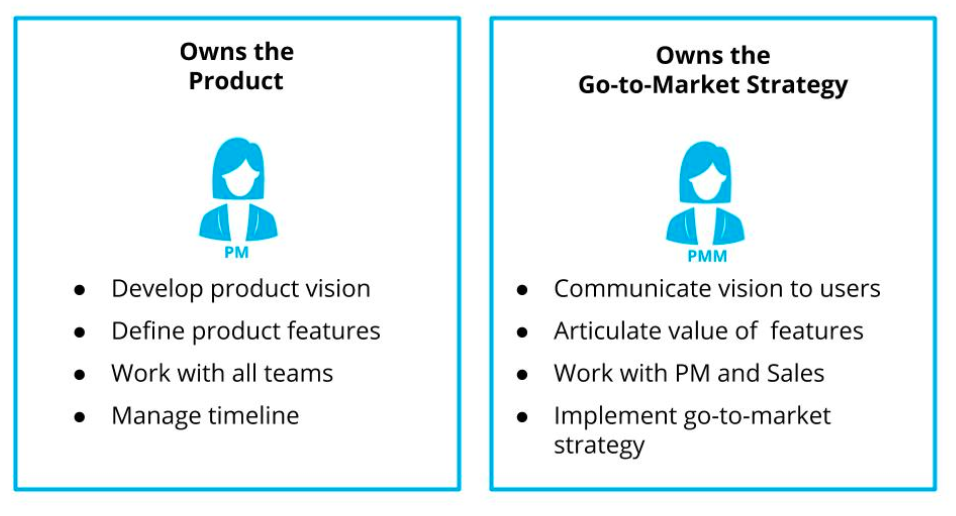

# Table of Contents

a. [Lesson Intro](#Lesson Intro)  
b. [PM and PMM Collaboration](#PM and PMM Collaboration)  
c. [Go-to-Market Strategy](#Go-to-Market Strategy)  
d. [Positioning and Messaging](#Positioning and Messaging)  
e. [Go-to-Market Example](#Go-to-Market Example)  
f. [Exercise: Marketing Message](#Exercise: Marketing Message)  
g. [Understanding Your Competition](#Understanding Your Competition)  
h. [TAM Review](#TAM Review)  
i. [Example: Competitive Research](#Example: Competitive Research)  
j. [Exercise: Competitive Research](#Exercise: Competitive Research)  
k. [Acquisition Channel Strategy](#Acquisition Channel Strategy)  
l. [Example: Acquisition Channels](#Example: Acquisition Channels)  
m. [Exercise: Acquisition Channels](#Exercise: Acquisition Channels)  
n. [Pricing Strategy](#Pricing Strategy)  
o. [Exercise: Pricing Strategy](#Exercise: Pricing Strategy)  
p. [Recap](#Recap)  

 

# Lesson Intro

Watch [the Lesson Intro](https://youtu.be/zNfeSEIf7Ns)

In this lesson we will cover:

- How PMMs and PMs work together
- Go-to-Market Strategy
- Understanding the Competition
- Acquisition Channel Strategy
- Pricing Strategy

 
 

# PM and PMM Collaboration

Watch [How Marketing and Product Managers Work Together](https://youtu.be/9-3I3rMX_Vc)

 

 

`PMM`: Product Marketing Manager or just Marketing

 

## Things to Remember About Working with PMMs

`Timing`: You should involve your product marketing manager as early as possible in the product development cycle.

`Communication`: A successful launch can be achieved only with great communication between you and all your partners.

`Relationship`: The PM and the PMM need to work closely together to create a comprehensive marketing strategy.

 
 

# Go-to-Market Strategy

Watch [the Go-to-Market Strategy](https://youtu.be/WMk2Q17UFfg)

 

`Go-to-Market Strategy`: A detailed plan of actionable items, which describes how you will achieve your product goals, acquire users and deliver value through your product to your target user. This includes:

- Pricing strategy- how you capture value
- Channel strategy- how you distribute your product
- Marketing campaigns- how you explain your product
- Customer journey map- how customers learn about and interact with your product
- Training for sales and support teams- how internal teams sell and help user with the product

 

`Value Proposition`: Benefits that your product delivers to address your target user’s needs. Another way to think about it: your product’s value proposition answers the question why your target user would buy/use your product.

`Product Positioning`: Where your product fits in the market for your target audience(s) given the product's value proposition. This can also highlight how your product is different compared to other products. You can have multiple product positioning statements

`Marketing Message`: A concise statement of the value your product delivers to users based on your product positioning. The marketing message should be easy for users to understand and convey what our product does.

 
 

## Things to Remember About Working with PMMs on a Go-to-Market Strategy

`Joint effort`: A solid go-to-market strategy requires the PM and PMM to closely work together. The PM is more of the product expert and the PMM is the market expert and both types of expertise is needed.

`Document the details`: It is critical to create a shared document with details about the product. Documenting the details ensures that everyone is working with the same information and prevents misunderstandings.

`Frequent meetings`: Communicate! Communicate! Communicate! You need to follow up as the launch approaches to ensure that there are no last minute delays.

 
 

# Positioning and Messaging

## From Value Proposition to Marketing Message

As part of the go-to-market strategy you'll want to work closely with Marketing. You’ll want to start with your product’s value proposition to help you create the product positioning statements. Once you have the product positioning you can create the messaging.

#### Value Proposition
As a reminder the value proposition for the product is created well before launch because it drives how the product that is designed and built.

 

#### Product Positioning
Product positioning should be:

More specific than your product’s value prop
Focused on a specific target user, audience, or segment
Include differentiation that is meaningful for this specific audience
Combine these three parts into one sentence:

For {Target Audience}, {Product Name} delivers {Product Benefit} better than other products because {Evidence of Superiority}

 

#### Example
“For World Wide Web users who enjoy books, Amazon.com is a retail bookseller that provides instant access to over 1.1 million books. Unlike traditional book retailers, Amazon.com provides a combination of extraordinary convenience, low prices, and comprehensive selection.”

This example is from a time when Amazon was just focused on selling books. As the company has grown, Amazon's value proposition and product positioning has evolved.

 

#### Marketing Message
Once you have determined your product positioning you can write your marketing message. The marketing message should communicate your product positioning in a concise statement that is easy for users to remember. 

Some tips to keep in mind:

- Be clear and concise
- Make it memorable
- Consider including a call to action

 

### Examples

“AirPods deliver effortless, all-day audio on the go. And AirPods Pro bring Active Noise Cancellation to an in-ear headphone — with a customizable fit. Find the right AirPods for you.” - Apple AirPods

“Venmo is a digital wallet that lets you make and share payments with friends. You can easily split the bill, cab fare, or much more. Download the iOS or Android app or sign up on Venmo.com today.” - Venmo

“Make Your Day. Real People. Real Videos. Text yourself a link to download TikTok” - TikTok

 
 

# Go-to-Market Example

Watch [the Go-to-Market Example](https://youtu.be/y5PEoPvZLHw)

Our goal was to convert free users to a paid model. Here is how we did it:

1. PM and PMM outlined the advantages of our product vs. the free version.

2. PMM to create multiple variants for our landing page. Team reviewed the options and used testing to select the most effective.

3. PMM created different promotions options to engage our users with our product. PM created tests to validate the promotions.

4. The PMM worked with the global marketing team to prepare prepare local support and check translations

5. PM and PMM worked together post-launch to create our product strategy going forward.

 
 

# Exercise: Marketing Message

Now let's figure out the positioning for our Party App and use that to write our marketing messages. Remember, our Party App has two distinct sets of users: party organizers and vendors.

Write a marketing message for our the two target users of our Party App

- [ ] Identify the target users for the product
- [ ] Define the product's value proposition for each user
- [ ] Determine how your product is superior to other products on the market
- [ ] Write a product positioning statement for your product for each target user
- [ ] Translate the product positioning into a marketing message for each target user

 
 

Watch [the solution walkthrough](https://youtu.be/CUOmok1CXe4)

 

`Two-sided Marketplace App` - An app that connects one type of user with another type of user. These products usually will have two sides: one for each type of user. For example, Uber connects drivers and riders with a separate platform for each type of user.

 

## Solution Recap

Our app is a two-sided marketplace app because we have a separate platform for the party organizers and the vendors who want to sell them services. We need two separate marketing messages.

#### Party Organizer side

Target users: people who want to organize a party
Value proposition: we provide access to everything you need to plan a party in one place

Our advantages:
- Easy to use
- All-in-one solution
- Full guide to what you need to organize a party
- Wish list incorporated with the party invite

Our marketing message for party organizers: “All-in-one party organization solution”.

 

#### Vendor side
Target users: vendors who want to sell products and services to party organizers
Value proposition: we connect vendors with customers who want to buy their services

Our advantages:
- Easy to use
- Customers are already in the process of planning a party

Our marketing message for vendors: “Instant Party Sales”.

 
 

### Additional Reading

Learn more about how PMs and PMMs work together here:

[How to Build an Amazing Relationship Between Product Management and Marketing](https://www.productplan.com/product-management-marketing-relationship/)

[Great marketing messaging strategies for successful campaigns](https://www.apifonica.com/en/blog/marketing-message/)

[Strategic Communication: How to Develop Strategic Messaging and Positioning](https://medium.com/the-marketing-playbook/strategic-communication-how-to-develop-strategic-messaging-and-positioning-3cc59689ca28)

[The 7 Components of a Brilliant Marketing Message](https://www.inc.com/geoffrey-james/7-components-of-a-brilliant-marketing-message.html)

[Craft a Positioning Statement](https://blog.hubspot.com/sales/positioning-statement)

 
 

# Understanding Your Competition

Watch [Understanding Your Competition's Market Share](https://youtu.be/ThrLinj3gJA)

 

`Competitors market share`: it is important to know what your competitors are doing and how well your competition is performing

`Know your TAM`: see the next page for a review of how to calculate TAM from the Product Strategy course.

`Research is your best friend`: You can do a lot of research online using free tools and articles. Your company may also have access to premium research sources. Always check your sources to make sure you are getting accurate and reliable data.

 
 

## Market Share Research Game Plan
There are a lot of ways to calculate your competitor's share. Here is one simple method:

1. Understand who your competitor sees as their target customers. 

For public companies, you may be able to identify the target customers from the company's published mission statement. Private companies will be trickier. Look for published research and articles online.

 

2. Search for market statistics. 

Look for both general data about the market space and specific data about the market leaders. That should give you a good view of the size of the market and the relative shares of your competitors.

 

3. Focus on the share smaller competitors are getting. 

That should give you a good sense of how much of the market share can be gained by targeting the smaller players. Taking on the biggest competitor from the get-go might be tricker.

 
 

# TAM Review

As you think about your competition and the opportunities for positioning your product, you'll want to have a good grasp on the Total Addressable Market for your product. To help you review this critical skill we brought back Alex King, the Instructor from the Product Strategy course to review TAM.

 

Watch [Total Addressable Market Review](https://youtu.be/np3ObqHG1F8)

 

### Things to Remember About TAM

TAM is a measure of the revenue opportunity for a product by estimating the size of the entire market

A larger TAM indicates a larger opportunity, with more demand for a particular product, but there are many other factors that will affect your product's success, including the strength of the competition.

 

### How to Calculate TAM
TAM = Average revenue per user X total number of potential users in the market

There are several approaches to calculating TAM:

### Top Down

You start with a high level view of the economy, and then narrow that down based on factors like demographics. For example, you usually will start will everyone in the world and narrow down that audience to people who are interested in your product.

 

### Bottoms Up
This involves using known data points that you have (data from early customers and sales) that you could extrapolate to represent a larger market opportunity. For example, if you are already selling a product in one region and were considering selling it globally.

 

### Value Theory
Generally used for new product categories where you don’t have much information to base estimates on. This involves conducting market research to understand how much people would pay for your product and how many potential customers you have.

 

Read more about TAM here:

[How to calculate your total addressable market and make a great TAM slide for investors](https://www.forentrepreneurs.com/calculating-tam/)

 
 

# Example: Competitive Research

Watch [Understanding Your Competitors and Market](https://youtu.be/RWaKByiHr9Q)

 

`Going down the rabbit hole`: A reference to the long and chaotic journey of Alice in the book Alice in Wonderland by Lewis Carroll. In this context it means spending too much time following research threads that are increasingly distant from the topic you are trying to understand.

 

### Things to Remember About Competitive Research

`Who are your competitors?` : Make sure you create a comprehensive list of competitors for your product. It is especially important if you are entering a new market.

`Estimate your competitor's market share`: Start by researching the target audience for the competitor. Research as much as you can and read multiple articles. You will probably need to extrapolate the available data to calculate the competitor's market share.

`Don't be discouraged by strong competitors`: Just because there are strong competitors, it doesn’t mean that there is no room for one more, especially if you have better product.

`Do your research and move on`: Do not go down the rabbit hole and spend too much time doing research. You have a product to launch!

 

### Sources used in our TAM calculation:

It is always important to cite any data you use!

[Quartz: The US is now buying more stretchy pants than blue jeans](https://qz.com/1218844/the-us-bought-more-yoga-pants-leggings-and-other-elastic-fabrics-than-blue-jeans-in-2017/)

[A Growth Strategy for Lululemon 2018](https://medium.com/@michaelangelo_q/a-growth-strategy-for-lululemon-68819680e511)

[US Population by Gender](https://www.statista.com/statistics/737923/us-population-by-gender)

[CSI Market: LULU's Competition by Segment and its Market Share](https://csimarket.com/stocks/competitionSEG2.php?code=LULU)

[90 degrees by Reflex](https://www.90degreebyreflex.com/pages/about-us)

If you search a bit more about Lululemon, you can run into this very interesting data:

[Lululemon’s website stats](https://www.similarweb.com/website/lululemon.com#search)

 
 

### Exercise

Calculate the TAM for the following scenario:

- Total number of people in the market: 28 M
- Average revenue per person: $52

Let’s continue the scenario from the previous quiz. Imagine you learn that a competitor had sales of $320.22M. Calculate the competitor’s market share. Round to the nearest percent and make sure to include % (e.g. XX%).

 
 

# Exercise: Competitive Research

Now that you have discussed how to analyze your competitor’s market share, it is your turn to give it a try with our Part App.

Using our party organizing app example, find a competitor, identify its target market and calculate its market share.

- [ ] Write down what you know about our target user and the problem our product solves for them

- [ ] Identify at least one competitor who might also be able to solve our user's problem

- [ ] Research the competitor using the internet. Pay attention to make sure you are using reliable sources!

- [ ] Using information you find on the internet, including the company's website and marketing, identify the competitor's target market

- [ ] Estimate the competitor's market share. For some competitors you may be able to find reported share numbers, but for others you may need to make your own rough calculation

 
 

Watch [the solution walkthrough](https://youtu.be/cIQVrXfyeD8).

 

Target audience: Users who need help organizing parties

Competitor in a similar space: Evite
Sources: [Evite website](https://www.evite.com/) and [Similarweb - Evite.com](https://www.similarweb.com/website/evite.com#overview)

Competitor's target audience: "College-educated, affluent females with children".
Source: [Evite Press Kit 2019](http://partners.evitecdn.com/Press%20Kit/Press%20Kit/Evite_PressKit_02.2019.pdf)

Competitor's market share: 0.26%
Source: [Evite Market Share and Competitor Report](Evite Market Share and Competitor Report)

 

What we can learn from a deeper look at the data:

1. We see a lot of competition, but it is not all in the same exact space so there is space for our product.

2. Even the best-known products don’t get a lot of traffic so we should not anticipate a lot of traffic initially.

 

You can learn more about researching the competition here:

[7 Ways to Better Understand Your Competitors](https://www.michiganstateuniversityonline.com/resources/leadership/ways-to-better-understand-your-competitors/)

[5 Things You Should Know About Your Competitors](https://thrivehive.com/5-things-you-should-know-about-your-competitors/)

 
 

# Acquisition Channel Strategy

Watch [Acquisition Channel Strategy](https://youtu.be/b9eULex5inY)

 

`Acquisition channel`: How your customers find your product

`Organic channel:` Acquisition channel where users find your product on their own

`Influencer`: A person or organization who has expert-level knowledge or a wide social reach in your target market

`SEO` (Search Engine Optimization): Increasing the search engine rankings of a website by optimizing its content and structure

`Viral channel`: Acquisition channel where users find us based on recommendations from others

 
 

### Acquisition Channels 

- Channels can be organic or viral
- Channels can be free or paid
- Recommendations can come from
    - SEO
    - Paid advertising
    - Rankings and features in the App Store and other marketplaces
    - Influencers

 
 

### Channel Strategy

- Partner with Marketing
- Consider the following factors
     - Who is your target user and what problem does your product solve?
     - What are the goals for the product
     - What is your budget and where can you get the best results for the money

 
 

# Example: Acquisition Channels

Watch [Acquisition Channels Example](https://youtu.be/jSvg9d7ax9U)

 

Converting Free to Paid Users: Our Channel Strategy

Our best users prospects were the people who were currently using the free version of our product

We tested several value propositions and marketing options and picked the most effective

After launch we used blog posts to give our product more exposure and guide users to our landing page

 
 

# Exercise: Acquisition Channels

We are now ready to figure out how we can reach the users for our Party App. Let's create our acquisition channel strategy.

In the real world you might be working with your Marketing partner on the channel strategy, but for this exercise you need to be both the PM and the PMM.

What is our acquisition channel strategy for the Party App? Don't forget that are users are both the people who want to organize parties and the vendors who want to sell them party products and services.

- [ ] Which channels might be effective to reach party organizers? Write down as many as you can think of.

- [ ] Which channels might be effective to reach our vendors? Write down as many as you can think of.

 
 

Watch [the solution walkthrough](https://youtu.be/7ZpVuyC00wk). 

 

I think we could reach party organizers through:

- SEO using keywords like "party venues", "party ideas" and "party supplies"
- Advertising on Pinterest
- Optimizing our App Store SEO
- Adding Share button to the app
- Advertising on Parenting blogs

 

We can reach vendors through

- Our Sales team
- Targeted SEO

 

Read more about acquisition channels:

[How to Find Your User Acquisition Channels](https://growthmarketingconf.com/how-to-find-your-user-acquisition-channels/)

[5 Steps To Choose Your Customer Acquisition Channel](https://brianbalfour.com/essays/5-steps-to-choose-your-customer-acquisition-channel)

 
 

# Pricing Strategy

Watch [Pricing Strategy](https://youtu.be/M5L7MBfshu8)

 

### Factors to Consider When Setting Pricing

- What value does the user get from using the product?
- What does the product cost to produce?
- What is your company's goal for the product?
- What do competitors charge?

 

### Things to Remember About Pricing

- The price can't be higher than the value your users get from the product
- In most cases, the price can't be lower than the long term cost to produce it
- The product's price must be consistent with goals for the product
- The price can't be higher than a competitor's price, unless you have a product that does a better job of meeting the user's need

 

### New Terms

`Ad Supported`: The product is free, but it generates revenue from advertisers.

`Cost-based pricing`: The cost to produce the product is the base price and a mark-up is added.

`Dynamic pricing `: Price changes reflect changes in supply or demand, e.g. surge pricing.

`Freemium`: The basic product is free but you can purchase additional features or content, e.g. Dropbox.

`Price discrimination`: Different users are charged a different price for the same product, e.g. US airline tickets.

`Value-based pricing`: Price is based on the value the user gets from the product.

As a PM, it is not your job to be a pricing expert. But you do need to understand the basic principles of pricing strategy and how your product fits in.

 
 

# Exercise: Pricing Strategy

It's time to figure out the pricing strategy for our Party App.

Two things to keep in mind:

- Our goal is to make money from this product.
- We have two different users for our product: party organizers and vendors.

What pricing model will you use for each user type? And where can we get revenue?

You'll need to think outside of the box for this one!

- [ ] Define the goals for the product
- [ ] Set a pricing strategy for the party organizers. What pricing model will you use?
- [ ] Set a pricing strategy for the vendors. What pricing model will you use?

 
 

Watch [the solution walkthrough](https://youtu.be/ywBQjdwnH-I).

 

Vendors:

- Free registration for vendors on the app
- Revenue sharing for products and services sold on the app

 

Party Organizers:

- Free user registration for party organizers
- Ad supported (to raise revenue)
- Freemium model for professional party organizers (pay a fee to get extra perks, discounts on purchases and special products

 

Read more about pricing strategy:

[5 Easy Steps to Creating the Right Pricing Strategy](https://www.inc.com/patricia-fletcher/5-easy-steps-to-create-the-right-pricing-strategy.html)

Read more about setting financial goals:

[Setting Financial Goals That Drive Your Business Forward](https://www.thebalancecareers.com/setting-business-financial-goals-3515712)

 
 

# Recap

Watch [the lesson recap](https://youtu.be/XolouKtcCFc).

We are moving along nicely with our product launch! In our next lesson, we'll talk about the other teams we need to work with as we get closer to launch day.

See you soon!

 
 
